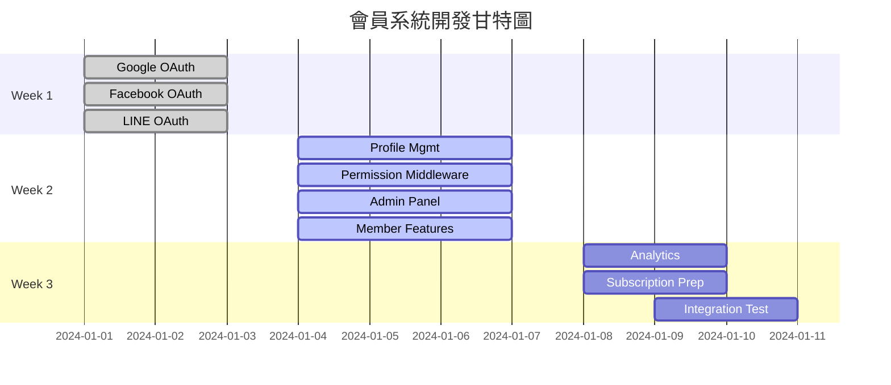

# BMad Method 會員系統開發拆解

## 🎯 BMad Method 方法論應用

### 核心原則
- **Agent 專業化**：每個 Agent 專注單一使用者故事
- **上下文最小化**：減少每個 Agent 需要理解的範圍
- **並行開發**：多個 Agent 同時工作，提升效率
- **規格驅動**：每個使用者故事都有完整的規格和驗收標準

## 📋 使用者故事完整拆解

### 第一階段：基礎認證功能（Week 1）

#### US001: Google OAuth 登入整合
**Agent**: OAuth-Google-Agent
**描述**: 身為新使用者，我想要透過 Google 帳號快速註冊和登入，以便於輕鬆開始使用會員功能
**驗收標準**:
- [ ] Google OAuth 提供商正確配置
- [ ] 用戶可以點擊「使用 Google 登入」按鈕
- [ ] 成功授權後自動創建用戶帳號
- [ ] 用戶資料正確同步到 MongoDB
- [ ] 登入後重定向到正確頁面

**技術規格**:
```typescript
// 需要實作的功能
- GoogleProvider 設定
- OAuth 回調處理
- 用戶資料映射
- 錯誤處理機制
```

**上下文文件**:
- NextAuth.js Google Provider 文檔
- MongoDB 用戶 Schema
- UI 登入按鈕設計

---

#### US002: Facebook OAuth 登入整合
**Agent**: OAuth-Facebook-Agent
**描述**: 身為新使用者，我想要透過 Facebook 帳號快速註冊和登入，以便於使用熟悉的社交平台身份
**驗收標準**:
- [ ] Facebook OAuth 提供商正確配置
- [ ] 用戶可以點擊「使用 Facebook 登入」按鈕
- [ ] 成功授權後自動創建用戶帳號
- [ ] 頭像和基本資料正確同步
- [ ] 處理 Facebook 特有的權限範圍

**技術規格**:
```typescript
// 需要實作的功能
- FacebookProvider 設定
- Facebook Graph API 整合
- 頭像下載和存儲
- 隱私設定處理
```

---

#### US003: LINE OAuth 登入整合
**Agent**: OAuth-LINE-Agent
**描述**: 身為台灣用戶，我想要透過 LINE 帳號登入，以便於使用最常用的通訊平台身份
**驗收標準**:
- [ ] LINE OAuth 提供商正確配置
- [ ] LINE Login 按鈕正確顯示
- [ ] 支援 LINE 特有的用戶 ID 格式
- [ ] 正確處理 LINE 的權限範圍
- [ ] LINE 頭像和暱稱同步

**技術規格**:
```typescript
// 需要實作的功能
- @auth/line-provider 設定
- LINE API 整合
- 台灣本地化處理
- LINE 特殊字符處理
```

---

### 第二階段：核心會員功能（Week 2）

#### US004: 會員個人資料管理
**Agent**: Profile-Management-Agent
**描述**: 身為會員，我想要能夠查看和編輯我的個人資料，以便於管理我的帳號資訊和使用偏好
**驗收標準**:
- [ ] 個人資料查看頁面
- [ ] 基本資訊編輯功能
- [ ] 偏好設定管理
- [ ] 頭像上傳和更換
- [ ] 帳號安全設定

**技術規格**:
```typescript
// 需要實作的組件
- ProfileView 組件
- ProfileEdit 組件  
- PreferencesPanel 組件
- AvatarUpload 組件
- API endpoints: GET/PUT /api/user/profile
```

**頁面結構**:
```
/profile
├── /basic-info      # 基本資訊
├── /preferences     # 使用偏好
├── /security        # 帳號安全
└── /subscription    # 訂閱狀態
```

---

#### US005: 權限驗證中間件
**Agent**: Permission-Middleware-Agent
**描述**: 身為系統管理者，我想要有靈活的權限控制機制，以便於保護敏感功能和內容
**驗收標準**:
- [ ] 頁面級別權限控制
- [ ] 功能級別權限檢查
- [ ] 會員等級驗證
- [ ] 未授權用戶重定向
- [ ] 權限錯誤友善提示

**技術規格**:
```typescript
// 需要實作的中間件
- withAuth HOC
- requireAuth 函數
- hasPermission 工具函數  
- 路由保護機制
```

---

#### US006: Payload CMS Admin 後台
**Agent**: Admin-Panel-Agent
**描述**: 身為網站管理者，我想要有一個直觀的後台界面管理用戶，以便於進行用戶支援和系統維護
**驗收標準**:
- [ ] Payload Admin UI 正常運行
- [ ] 用戶列表查看和搜尋
- [ ] 用戶角色和等級管理
- [ ] 用戶登入歷史查看
- [ ] 批量操作功能

**技術規格**:
```typescript
// Payload 配置
- Users collection 設定
- Admin UI 客製化
- 權限控制設定
- 搜尋和過濾功能
```

---

#### US007: 會員專屬功能展示
**Agent**: Member-Features-Agent  
**描述**: 身為會員，我想要看到與訪客不同的界面和功能，以便於享受會員專屬服務
**驗收標準**:
- [ ] 會員專屬導航選單
- [ ] 進階功能標記和說明
- [ ] 使用限額顯示
- [ ] 會員等級徽章
- [ ] 升級引導提示

**技術規格**:
```typescript
// 需要實作的組件
- MemberNavigation 組件
- FeatureGate 組件
- UsageIndicator 組件
- UpgradePrompt 組件
```

---

### 第三階段：進階功能（Week 3）

#### US008: 使用行為記錄系統
**Agent**: Analytics-Agent
**描述**: 身為產品經理，我想要追蹤用戶行為數據，以便於優化功能和提供個人化服務
**驗收標準**:
- [ ] 功能使用記錄
- [ ] 登入活動追蹤  
- [ ] 使用統計儀表板
- [ ] 個人化推薦基礎
- [ ] 隱私權限控制

**技術規格**:
```typescript
// 需要實作的功能
- 事件追蹤系統
- 使用統計 API
- 個人儀表板
- 隱私設定管理
```

---

#### US009: 付費會員準備功能
**Agent**: Subscription-Prep-Agent
**描述**: 身為產品擁有者，我想要建立付費會員的基礎架構，以便於未來推出付費服務
**驗收標準**:
- [ ] 訂閱計劃數據模型
- [ ] 會員等級升降級邏輯
- [ ] 付費功能標記系統
- [ ] 試用期管理
- [ ] Stripe 整合預備

**技術規格**:
```typescript
// 數據模型
interface SubscriptionPlan {
  id: string
  name: string
  price: number
  features: string[]
  trialDays: number
}

interface UserSubscription {
  planId: string
  status: 'active' | 'cancelled' | 'trial'
  currentPeriodEnd: Date
  stripeCustomerId?: string
}
```

---

#### US010: 系統整合測試
**Agent**: Integration-Test-Agent
**描述**: 身為 QA 工程師，我想要確保所有功能正確整合，以便於保證系統品質
**驗收標準**:
- [ ] 端到端測試覆蓋
- [ ] 跨瀏覽器兼容性
- [ ] 移動端響應式測試
- [ ] 性能基準測試
- [ ] 安全漏洞掃描

---

## 🔄 Agent 協作流程

### 並行開發策略


### Agent 溝通協議
```typescript
// 跨 Agent 數據交換格式
interface AgentOutput {
  agentId: string
  userStoryId: string
  status: 'completed' | 'in-progress' | 'blocked' | 'failed'
  deliverables: {
    code: string[]           // 程式碼檔案
    tests: string[]          // 測試檔案  
    documentation: string[]  // 文檔檔案
    dependencies: string[]   // 新增的依賴
  }
  blockers?: string[]        // 阻礙因素
  nextSteps?: string[]       // 後續步驟
}
```

## 🧪 測試策略

### 每個使用者故事的測試要求
```typescript
// US001 測試範例
describe('Google OAuth Integration', () => {
  test('should redirect to Google OAuth', async () => {
    // 測試 OAuth 重定向
  })
  
  test('should create user on successful auth', async () => {
    // 測試用戶創建
  })
  
  test('should handle OAuth errors gracefully', async () => {
    // 測試錯誤處理
  })
})
```

### 整合測試清單
- [ ] 完整的登入流程測試
- [ ] 權限控制驗證
- [ ] 資料庫同步檢查
- [ ] API 端點測試
- [ ] UI/UX 響應式測試

## 📊 進度追蹤

### KPI 指標
```typescript
interface DevelopmentMetrics {
  userStoriesCompleted: number
  codeQuality: {
    testCoverage: number      // 目標: >85%
    eslintErrors: number      // 目標: 0
    typeErrors: number        // 目標: 0
  }
  performance: {
    loginLatency: number      // 目標: <2s
    pageLoadTime: number      // 目標: <3s
  }
  functionality: {
    oauthSuccessRate: number  // 目標: >95%
    adminPanelUptime: number  // 目標: >99%
  }
}
```

### 每日站會報告格式
```markdown
## Agent 進度報告

**Date**: YYYY-MM-DD
**Agent**: [Agent Name]
**User Story**: [US-XXX]

### 昨日完成：
- [ ] 完成項目 1
- [ ] 完成項目 2

### 今日計劃：
- [ ] 計劃項目 1
- [ ] 計劃項目 2

### 阻礙因素：
- 問題描述和解決方案

### 需要支援：
- 技術問題或資源需求
```

---

**總結**：透過 BMad Method 的精細拆解，我們將複雜的會員系統開發分解為 10 個明確的使用者故事，每個都有專門的 Agent 負責，大幅降低了開發複雜度並提升了並行效率。