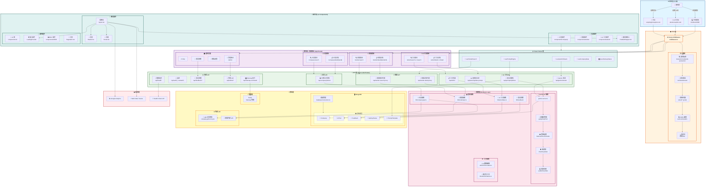

# 完整系統架構圖

```mermaid
flowchart TD
    %% ============================================
    %% 使用者入口層 (User Entry Layer)
    %% ============================================
    subgraph UserLayer["🌐 使用者入口層"]
        direction TB
        User["👤 使用者"]
        MainDomain["🏢 主站<br/>corpinsight.leopilot.com"]
        AIToolsDomain["🤖 AI 工具站<br/>aitools.leopilot.com"]
        LocalDev["💻 本地開發<br/>localhost:3000"]
    end

    %% ============================================
    %% 中介層 (Middleware Layer)
    %% ============================================
    subgraph MiddlewareLayer["🛡️ 中介層"]
        direction TB
        Middleware["⚙️ Next.js Middleware<br/>middleware.ts"]

        subgraph MiddlewareLogic["中介邏輯"]
            EnvDetect["🔍 環境檢測<br/>dev/prod-local/prod-production"]
            CORS["🔒 CORS 處理<br/>setCorsHeaders"]
            DomainRoute["🔀 域名路由<br/>isAiToolsDomain"]
            PathBlock["🚫 路徑封鎖<br/>/aitool/* (prod)"]
            Redirect["↪️ 重定向<br/>跨域 301"]
        end
    end

    %% ============================================
    %% 應用層 - 路由 (Application Layer - Routes)
    %% ============================================
    subgraph AppRoutes["📄 應用層 - 頁面路由 (App Router)"]
        direction TB

        subgraph CompanyRoutes["🏢 企業模組"]
            CompanySearch["🔍 企業搜尋<br/>/company/search"]
            CompanyDetail["📋 企業詳情<br/>/company/detail/[taxId]"]
        end

        subgraph TenderRoutes["📝 標案模組"]
            TenderSearch["🔍 標案搜尋<br/>/tender/search"]
            TenderDetail["📋 標案詳情<br/>/tender/detail/[tenderId]"]
        end

        subgraph AIToolRoutes["🤖 AI 工具模組"]
            AIToolSearch["🔍 工具搜尋<br/>/aitool/search or /search"]
            AIToolDetail["📋 工具詳情<br/>/aitool/detail or /detail"]
        end

        subgraph UniversalRoutes["🌍 通用頁面"]
            FAQ["❓ FAQ"]
            Feedback["💬 意見回饋"]
            Privacy["🔐 隱私政策"]
            Admin["👑 管理後台<br/>/admin"]
        end
    end

    %% ============================================
    %% 應用層 - API (Application Layer - API)
    %% ============================================
    subgraph APILayer["🔌 API 層 (Server-side Routes)"]
        direction TB

        subgraph CompanyAPI["🏢 企業 API"]
            CompanyTwincn["📊 台灣公司資料<br/>/api/company/twincn"]
        end

        subgraph TenderAPI["📝 標案 API"]
            TenderProxy["🔄 標案搜尋代理<br/>/api/tender-search-proxy"]
            TenderDetailProxy["🔄 標案詳情代理<br/>/api/tender-detail-proxy"]
        end

        subgraph AIToolAPI["🤖 AI 工具 API"]
            AIToolQuery["📋 工具查詢<br/>/api/aitool"]
            UpdatePrompt["✏️ 更新提示詞<br/>/api/aitool/update-prompt"]
            GeminiStream["🌊 Gemini 串流<br/>/api/gemini/stream"]
            PromptOptimize["🎯 提示詞優化<br/>/api/prompt/optimize"]
        end

        subgraph SystemAPI["⚙️ 系統 API"]
            HealthCheck["💚 健康檢查<br/>/api/health"]
            Auth["🔑 認證<br/>/api/auth/[...nextauth]"]
            FeedbackAPI["💬 意見回饋<br/>/api/feedback/*"]
            AdminAPI["👑 管理 API<br/>/api/admin/*"]
            SitemapCmd["🗺️ Sitemap 指令<br/>/api/sitemap-command"]
        end
    end

    %% ============================================
    %% 服務層 (Service Layer)
    %% ============================================
    subgraph ServiceLayer["⚡ 服務層 (Business Logic)"]
        direction TB

        subgraph GeminiService["🧠 Gemini AI 服務"]
            direction LR
            GeminiServer["gemini.server.ts"]
            KeyPool["🔑 金鑰池管理<br/>getApiKeyPool"]
            Strategy["📊 策略選擇<br/>Failover/Round-Robin"]
            CircuitBreaker["🛡️ 斷路器<br/>checkKeyState"]
            Backoff["⏱️ 指數退避<br/>updateKeyState"]
        end

        subgraph DataServices["📦 資料服務"]
            CompanyService["🏢 企業服務<br/>lib/company/api.ts"]
            TenderService["📝 標案服務<br/>lib/tender/api.ts"]
            AIToolService["🤖 AI 工具服務<br/>lib/aitool/data.ts"]
            FeedbackService["💬 意見回饋<br/>lib/feedback/"]
        end

        subgraph UtilServices["🛠️ 工具服務"]
            TCMFormatter["🇹🇼 繁簡轉換<br/>utils/tcmFormatter.ts"]
            Formatters["📐 格式化工具<br/>lib/utils/formatters.ts"]
        end
    end

    %% ============================================
    %% 資料層 (Data Layer)
    %% ============================================
    subgraph DataLayer["💾 資料層"]
        direction TB

        subgraph Database["🗄️ MongoDB"]
            direction LR
            DBConnection["連線管理<br/>database/connection.ts"]

            subgraph Models["📊 資料模型"]
                CompanyModel["🏢 Company"]
                AIToolModel["🤖 AITool"]
                FeedbackModel["💬 Feedback"]
                ApiKeyModel["🔑 ApiKeyStatus"]
                PromptTemplate["📝 PromptTemplate"]
            end
        end

        subgraph ExternalAPIs["🌐 外部 API"]
            G0VCompany["🏢 g0v 企業資料<br/>company.g0v.ronny.tw"]
            TenderExternal["📝 標案外部 API"]
        end

        subgraph Cache["⚡ 快取層"]
            Redis["Redis<br/>Sitemap 快取"]
        end
    end

    %% ============================================
    %% 組件層 (Component Layer)
    %% ============================================
    subgraph ComponentLayer["🧩 組件層 (UI Components)"]
        direction TB

        subgraph Layout["📐 佈局組件"]
            RootLayout["根佈局<br/>layout.tsx"]
            Header["🎯 頁首<br/>Header.tsx"]
            Footer["🦶 頁尾<br/>Footer.tsx"]
        end

        subgraph FeatureComponents["🎨 功能組件"]
            CompanyComps["🏢 企業組件<br/>components/company/"]
            TenderComps["📝 標案組件<br/>components/tender/"]
            AIToolComps["🤖 AI 工具組件<br/>components/aitool/"]
            ChatbotWrapper["💬 聊天機器人<br/>ChatbotWrapper.tsx"]
        end

        subgraph CommonComponents["🔧 通用組件"]
            UILib["🎨 UI 庫<br/>components/ui/"]
            Loading["⏳ 載入組件<br/>LoadingProvider"]
            SEO["📊 SEO 組件<br/>components/SEO/"]
            Pagination["📄 分頁<br/>Pagination.tsx"]
        end
    end

    %% ============================================
    %% Hooks 層 (Custom Hooks)
    %% ============================================
    subgraph HooksLayer["🪝 React Hooks 層"]
        direction LR
        useGemini["🧠 useGeminiStream"]
        usePrompt["📝 usePromptEngine"]
        useTender["📝 useTenderSearch"]
        useCompany["🏢 useCompanyData"]
        useSitemap["🗺️ useSitemapStatus"]
    end

    %% ============================================
    %% 監控層 (Monitoring Layer)
    %% ============================================
    subgraph MonitoringLayer["📊 監控層"]
        direction LR
        GA["📈 Google Analytics"]
        WebVitals["⚡ Web Vitals Tracker"]
        HealthAPI["💚 Health Check API"]
    end

    %% ============================================
    %% 連接關係 (Connections)
    %% ============================================

    %% 使用者 -> 入口
    User -->|訪問主站| MainDomain
    User -->|訪問 AI 站| AIToolsDomain
    User -->|本地開發| LocalDev

    %% 入口 -> 中介層
    MainDomain --> Middleware
    AIToolsDomain --> Middleware
    LocalDev --> Middleware

    %% 中介層邏輯流
    Middleware --> EnvDetect
    EnvDetect --> DomainRoute
    DomainRoute --> PathBlock
    PathBlock --> CORS
    CORS --> Redirect

    %% 中介層 -> 應用層路由
    Middleware --> CompanyRoutes
    Middleware --> TenderRoutes
    Middleware --> AIToolRoutes
    Middleware --> UniversalRoutes

    %% 頁面路由 -> API 層
    CompanySearch --> CompanyAPI
    CompanyDetail --> CompanyAPI
    TenderSearch --> TenderAPI
    TenderDetail --> TenderAPI
    AIToolSearch --> AIToolAPI
    AIToolDetail --> AIToolAPI
    Feedback --> FeedbackAPI
    Admin --> AdminAPI

    %% API 層 -> 服務層
    CompanyTwincn --> CompanyService
    TenderProxy --> TenderService
    TenderDetailProxy --> TenderService
    AIToolQuery --> AIToolService
    UpdatePrompt --> AIToolService
    GeminiStream --> GeminiServer
    PromptOptimize --> GeminiServer

    %% 服務層內部流
    GeminiServer --> KeyPool
    KeyPool --> Strategy
    Strategy --> CircuitBreaker
    CircuitBreaker --> Backoff

    %% 服務層 -> 資料層
    GeminiServer --> ApiKeyModel
    CompanyService --> G0VCompany
    CompanyService --> CompanyModel
    TenderService --> TenderExternal
    AIToolService --> AIToolModel
    FeedbackService --> FeedbackModel

    %% 資料層連接
    DBConnection --> Models
    PromptOptimize --> PromptTemplate
    SitemapCmd --> Redis

    %% 組件層 -> Hooks
    FeatureComponents --> HooksLayer

    %% Hooks -> API
    useGemini --> GeminiStream
    usePrompt --> PromptOptimize
    useTender --> TenderAPI

    %% 佈局組件
    RootLayout --> Header
    RootLayout --> Footer
    RootLayout --> Loading
    RootLayout --> ChatbotWrapper

    %% 監控連接
    RootLayout --> GA
    RootLayout --> WebVitals
    HealthCheck --> HealthAPI

    %% 樣式定義
    classDef userClass fill:#e1f5ff,stroke:#01579b,stroke-width:2px,color:#000
    classDef middlewareClass fill:#fff3e0,stroke:#e65100,stroke-width:2px,color:#000
    classDef routeClass fill:#f3e5f5,stroke:#4a148c,stroke-width:2px,color:#000
    classDef apiClass fill:#e8f5e9,stroke:#1b5e20,stroke-width:2px,color:#000
    classDef serviceClass fill:#fce4ec,stroke:#880e4f,stroke-width:2px,color:#000
    classDef dataClass fill:#fff9c4,stroke:#f57f17,stroke-width:2px,color:#000
    classDef componentClass fill:#e0f2f1,stroke:#004d40,stroke-width:2px,color:#000
    classDef monitorClass fill:#ffebee,stroke:#b71c1c,stroke-width:2px,color:#000

    class UserLayer userClass
    class MiddlewareLayer,Middleware,MiddlewareLogic middlewareClass
    class AppRoutes,CompanyRoutes,TenderRoutes,AIToolRoutes,UniversalRoutes routeClass
    class APILayer,CompanyAPI,TenderAPI,AIToolAPI,SystemAPI apiClass
    class ServiceLayer,GeminiService,DataServices,UtilServices serviceClass
    class DataLayer,Database,ExternalAPIs,Cache dataClass
    class ComponentLayer,Layout,FeatureComponents,CommonComponents,HooksLayer componentClass
    class MonitoringLayer monitorClass
```
