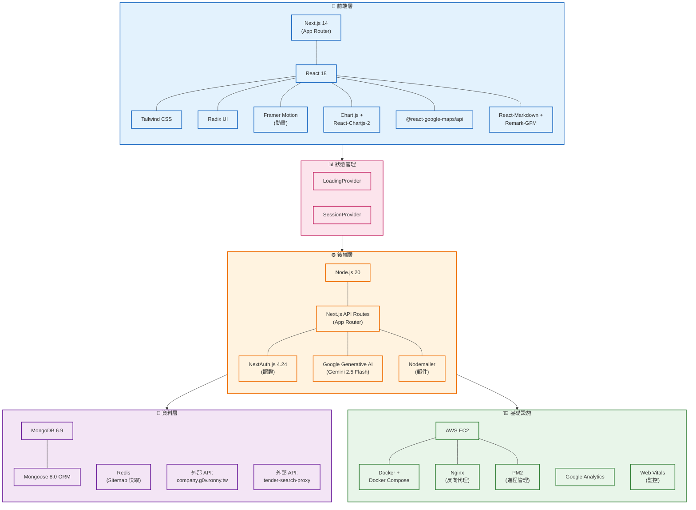

# 技術棧架構圖

```mermaid
graph TD
    subgraph Frontend["🎨 前端層"]
        direction TB
        NextJS["Next.js 14<br/>(App Router)"]
        React["React 18"]
        TailwindCSS["Tailwind CSS"]
        RadixUI["Radix UI"]
        FramerMotion["Framer Motion<br/>(動畫)"]
        ChartJS["Chart.js +<br/>React-Chartjs-2"]
        GoogleMaps["@react-google-maps/api"]
        ReactMarkdown["React-Markdown +<br/>Remark-GFM"]

        NextJS --- React
        React --- TailwindCSS
        React --- RadixUI
        React --- FramerMotion
        React --- ChartJS
        React --- GoogleMaps
        React --- ReactMarkdown
    end

    subgraph StateManagement["📊 狀態管理"]
        LoadingProvider["LoadingProvider"]
        SessionProvider["SessionProvider"]
    end

    subgraph Backend["⚙️ 後端層"]
        direction TB
        NodeJS["Node.js 20"]
        APIRoutes["Next.js API Routes<br/>(App Router)"]
        NextAuth["NextAuth.js 4.24<br/>(認證)"]
        GeminiAI["Google Generative AI<br/>(Gemini 2.5 Flash)"]
        Nodemailer["Nodemailer<br/>(郵件)"]

        NodeJS --- APIRoutes
        APIRoutes --- NextAuth
        APIRoutes --- GeminiAI
        APIRoutes --- Nodemailer
    end

    subgraph DataLayer["💾 資料層"]
        direction TB
        MongoDB["MongoDB 6.9"]
        Mongoose["Mongoose 8.0 ORM"]
        Redis["Redis<br/>(Sitemap 快取)"]
        G0VAPI["外部 API:<br/>company.g0v.ronny.tw"]
        TenderAPI["外部 API:<br/>tender-search-proxy"]

        MongoDB --- Mongoose
    end

    subgraph Infrastructure["🏗️ 基礎設施"]
        direction TB
        Docker["Docker +<br/>Docker Compose"]
        EC2["AWS EC2"]
        Nginx["Nginx<br/>(反向代理)"]
        PM2["PM2<br/>(進程管理)"]
        GA["Google Analytics"]
        WebVitals["Web Vitals<br/>(監控)"]

        EC2 --- Nginx
        EC2 --- PM2
        EC2 --- Docker
    end

    Frontend --> StateManagement
    StateManagement --> Backend
    Backend --> DataLayer
    Backend --> Infrastructure

    classDef frontendClass fill:#e3f2fd,stroke:#1565c0,stroke-width:2px
    classDef backendClass fill:#fff3e0,stroke:#ef6c00,stroke-width:2px
    classDef dataClass fill:#f3e5f5,stroke:#6a1b9a,stroke-width:2px
    classDef infraClass fill:#e8f5e9,stroke:#2e7d32,stroke-width:2px
    classDef stateClass fill:#fce4ec,stroke:#c2185b,stroke-width:2px

    class Frontend,NextJS,React,TailwindCSS,RadixUI,FramerMotion,ChartJS,GoogleMaps,ReactMarkdown frontendClass
    class Backend,NodeJS,APIRoutes,NextAuth,GeminiAI,Nodemailer backendClass
    class DataLayer,MongoDB,Mongoose,Redis,G0VAPI,TenderAPI dataClass
    class Infrastructure,Docker,EC2,Nginx,PM2,GA,WebVitals infraClass
    class StateManagement,LoadingProvider,SessionProvider stateClass
```
