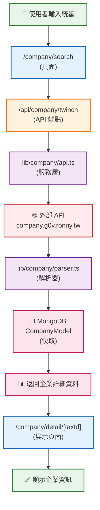

# 企業查詢資料流

```mermaid
flowchart TD
    Start["👤 使用者輸入統編"] --> Page["/company/search<br/>(頁面)"]
    Page --> API["/api/company/twincn<br/>(API 端點)"]
    API --> Service["lib/company/api.ts<br/>(服務層)"]
    Service --> ExternalAPI["🌐 外部 API<br/>company.g0v.ronny.tw"]
    ExternalAPI --> Parser["lib/company/parser.ts<br/>(解析器)"]
    Parser --> Cache["💾 MongoDB<br/>CompanyModel<br/>(快取)"]
    Cache --> Return["📊 返回企業詳細資料"]
    Return --> Detail["/company/detail/[taxId]<br/>(展示頁面)"]
    Detail --> End["✅ 顯示企業資訊"]

    classDef userClass fill:#e8f5e9,stroke:#2e7d32,stroke-width:2px
    classDef pageClass fill:#e3f2fd,stroke:#1565c0,stroke-width:2px
    classDef apiClass fill:#fff3e0,stroke:#ef6c00,stroke-width:2px
    classDef serviceClass fill:#f3e5f5,stroke:#6a1b9a,stroke-width:2px
    classDef externalClass fill:#ffebee,stroke:#c62828,stroke-width:2px
    classDef dataClass fill:#fce4ec,stroke:#c2185b,stroke-width:2px

    class Start,End userClass
    class Page,Detail pageClass
    class API apiClass
    class Service,Parser serviceClass
    class ExternalAPI externalClass
    class Cache,Return dataClass
```
