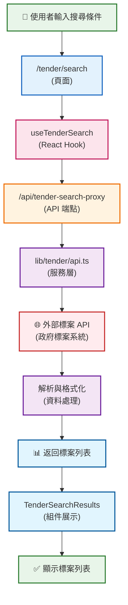

# 標案搜尋資料流

```mermaid
flowchart TD
    Start["👤 使用者輸入搜尋條件"] --> Page["/tender/search<br/>(頁面)"]
    Page --> Hook["useTenderSearch<br/>(React Hook)"]
    Hook --> API["/api/tender-search-proxy<br/>(API 端點)"]
    API --> Service["lib/tender/api.ts<br/>(服務層)"]
    Service --> ExternalAPI["🌐 外部標案 API<br/>(政府標案系統)"]
    ExternalAPI --> Parse["解析與格式化<br/>(資料處理)"]
    Parse --> Return["📊 返回標案列表"]
    Return --> Component["TenderSearchResults<br/>(組件展示)"]
    Component --> End["✅ 顯示標案列表"]

    classDef userClass fill:#e8f5e9,stroke:#2e7d32,stroke-width:2px
    classDef pageClass fill:#e3f2fd,stroke:#1565c0,stroke-width:2px
    classDef hookClass fill:#fce4ec,stroke:#c2185b,stroke-width:2px
    classDef apiClass fill:#fff3e0,stroke:#ef6c00,stroke-width:2px
    classDef serviceClass fill:#f3e5f5,stroke:#6a1b9a,stroke-width:2px
    classDef externalClass fill:#ffebee,stroke:#c62828,stroke-width:2px
    classDef dataClass fill:#e1f5fe,stroke:#01579b,stroke-width:2px

    class Start,End userClass
    class Page pageClass
    class Hook hookClass
    class API apiClass
    class Service,Parse serviceClass
    class ExternalAPI externalClass
    class Return,Component dataClass
```
