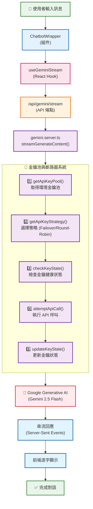

# AI 工具聊天資料流

```mermaid
flowchart TD
    Start["👤 使用者輸入訊息"] --> Component["ChatbotWrapper<br/>(組件)"]
    Component --> Hook["useGeminiStream<br/>(React Hook)"]
    Hook --> API["/api/gemini/stream<br/>(API 端點)"]
    API --> ServerFunc["gemini.server.ts<br/>streamGenerateContent()"]

    ServerFunc --> KeyPoolSystem["🔑 金鑰池與斷路器系統"]

    subgraph KeyPoolSystem["🔑 金鑰池與斷路器系統"]
        direction TB
        Step1["1️⃣ getApiKeyPool()<br/>取得環境金鑰池"]
        Step2["2️⃣ getApiKeyStrategy()<br/>選擇策略 (Failover/Round-Robin)"]
        Step3["3️⃣ checkKeyState()<br/>檢查金鑰健康狀態"]
        Step4["4️⃣ attemptApiCall()<br/>執行 API 呼叫"]
        Step5["5️⃣ updateKeyState()<br/>更新金鑰狀態"]

        Step1 --> Step2
        Step2 --> Step3
        Step3 --> Step4
        Step4 --> Step5
    end

    KeyPoolSystem --> GeminiAPI["🤖 Google Generative AI<br/>(Gemini 2.5 Flash)"]
    GeminiAPI --> Stream["串流回應<br/>(Server-Sent Events)"]
    Stream --> Frontend["前端逐字顯示"]
    Frontend --> End["✅ 完成對話"]

    classDef userClass fill:#e8f5e9,stroke:#2e7d32,stroke-width:2px
    classDef componentClass fill:#e3f2fd,stroke:#1565c0,stroke-width:2px
    classDef hookClass fill:#fce4ec,stroke:#c2185b,stroke-width:2px
    classDef apiClass fill:#fff3e0,stroke:#ef6c00,stroke-width:2px
    classDef systemClass fill:#f3e5f5,stroke:#6a1b9a,stroke-width:2px
    classDef aiClass fill:#ffebee,stroke:#c62828,stroke-width:2px
    classDef streamClass fill:#e1f5fe,stroke:#01579b,stroke-width:2px

    class Start,End userClass
    class Component componentClass
    class Hook hookClass
    class API apiClass
    class ServerFunc,Step1,Step2,Step3,Step4,Step5 systemClass
    class GeminiAPI aiClass
    class Stream,Frontend streamClass
```
