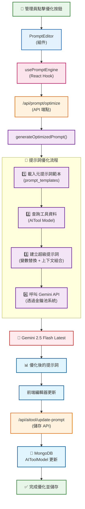

# 提示詞優化資料流

```mermaid
flowchart TD
    Start["🔧 管理員點擊優化按鈕"] --> Component["PromptEditor<br/>(組件)"]
    Component --> Hook["usePromptEngine<br/>(React Hook)"]
    Hook --> API["/api/prompt/optimize<br/>(API 端點)"]
    API --> ServerFunc["generateOptimizedPrompt()"]

    ServerFunc --> OptimizationProcess["📝 提示詞優化流程"]

    subgraph OptimizationProcess["📝 提示詞優化流程"]
        direction TB
        Step1["1️⃣ 載入元提示詞範本<br/>(prompt_templates)"]
        Step2["2️⃣ 查詢工具資料<br/>(AITool Model)"]
        Step3["3️⃣ 建立超級提示詞<br/>(變數替換 + 上下文組合)"]
        Step4["4️⃣ 呼叫 Gemini API<br/>(透過金鑰池系統)"]

        Step1 --> Step2
        Step2 --> Step3
        Step3 --> Step4
    end

    OptimizationProcess --> GeminiAPI["🤖 Gemini 2.5 Flash Latest"]
    GeminiAPI --> Result["📊 優化後的提示詞"]
    Result --> EditorUpdate["前端編輯器更新"]
    EditorUpdate --> SaveAPI["/api/aitool/update-prompt<br/>(儲存 API)"]
    SaveAPI --> MongoDB["💾 MongoDB<br/>AIToolModel 更新"]
    MongoDB --> End["✅ 完成優化並儲存"]

    classDef userClass fill:#e8f5e9,stroke:#2e7d32,stroke-width:2px
    classDef componentClass fill:#e3f2fd,stroke:#1565c0,stroke-width:2px
    classDef hookClass fill:#fce4ec,stroke:#c2185b,stroke-width:2px
    classDef apiClass fill:#fff3e0,stroke:#ef6c00,stroke-width:2px
    classDef processClass fill:#f3e5f5,stroke:#6a1b9a,stroke-width:2px
    classDef aiClass fill:#ffebee,stroke:#c62828,stroke-width:2px
    classDef dataClass fill:#e1f5fe,stroke:#01579b,stroke-width:2px

    class Start,End userClass
    class Component componentClass
    class Hook hookClass
    class API,SaveAPI apiClass
    class ServerFunc,Step1,Step2,Step3,Step4 processClass
    class GeminiAPI aiClass
    class Result,EditorUpdate,MongoDB dataClass
```
