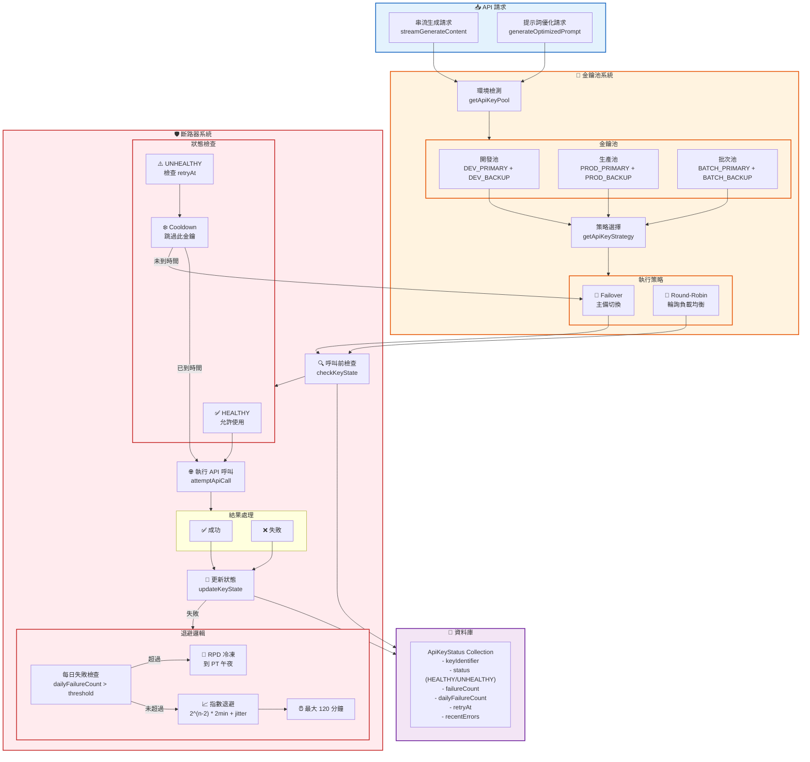

# Gemini AI 智慧金鑰池架構

```mermaid
flowchart TD
    subgraph Request["📥 API 請求"]
        StreamReq["串流生成請求<br/>streamGenerateContent"]
        OptimizeReq["提示詞優化請求<br/>generateOptimizedPrompt"]
    end

    subgraph KeyPoolSystem["🔑 金鑰池系統"]
        direction TB
        EnvDetect["環境檢測<br/>getApiKeyPool"]

        subgraph Pools["金鑰池"]
            DevPool["開發池<br/>DEV_PRIMARY + DEV_BACKUP"]
            ProdPool["生產池<br/>PROD_PRIMARY + PROD_BACKUP"]
            BatchPool["批次池<br/>BATCH_PRIMARY + BATCH_BACKUP"]
        end

        StrategySelect["策略選擇<br/>getApiKeyStrategy"]

        subgraph Strategies["執行策略"]
            Failover["🔄 Failover<br/>主備切換"]
            RoundRobin["🔁 Round-Robin<br/>輪詢負載均衡"]
        end
    end

    subgraph CircuitBreakerSystem["🛡️ 斷路器系統"]
        direction TB
        PreCheck["🔍 呼叫前檢查<br/>checkKeyState"]

        subgraph StateCheck["狀態檢查"]
            HealthyCheck["✅ HEALTHY<br/>允許使用"]
            UnhealthyCheck["⚠️ UNHEALTHY<br/>檢查 retryAt"]
            CooldownCheck["❄️ Cooldown<br/>跳過此金鑰"]
        end

        APICall["🌐 執行 API 呼叫<br/>attemptApiCall"]

        subgraph Result["結果處理"]
            Success["✅ 成功"]
            Failure["❌ 失敗"]
        end

        UpdateState["📝 更新狀態<br/>updateKeyState"]

        subgraph BackoffLogic["退避邏輯"]
            DailyCheck["每日失敗檢查<br/>dailyFailureCount > threshold"]
            RPDCooldown["🌅 RPD 冷凍<br/>到 PT 午夜"]
            ExpoBackoff["📈 指數退避<br/>2^(n-2) * 2min + jitter"]
            MaxBackoff["⏰ 最大 120 分鐘"]
        end
    end

    subgraph Database["💾 資料庫"]
        ApiKeyStatus["ApiKeyStatus Collection<br/>- keyIdentifier<br/>- status (HEALTHY/UNHEALTHY)<br/>- failureCount<br/>- dailyFailureCount<br/>- retryAt<br/>- recentErrors"]
    end

    %% 流程連接
    StreamReq --> EnvDetect
    OptimizeReq --> EnvDetect

    EnvDetect --> Pools
    DevPool --> StrategySelect
    ProdPool --> StrategySelect
    BatchPool --> StrategySelect

    StrategySelect --> Strategies
    Failover --> PreCheck
    RoundRobin --> PreCheck

    PreCheck --> StateCheck
    HealthyCheck --> APICall
    UnhealthyCheck --> CooldownCheck
    CooldownCheck -->|未到時間| Failover
    CooldownCheck -->|已到時間| APICall

    APICall --> Result
    Success --> UpdateState
    Failure --> UpdateState

    UpdateState -->|失敗| BackoffLogic
    DailyCheck -->|超過| RPDCooldown
    DailyCheck -->|未超過| ExpoBackoff
    ExpoBackoff --> MaxBackoff

    UpdateState --> Database
    PreCheck --> Database

    classDef reqClass fill:#e3f2fd,stroke:#1565c0,stroke-width:2px
    classDef poolClass fill:#fff3e0,stroke:#e65100,stroke-width:2px
    classDef cbClass fill:#ffebee,stroke:#c62828,stroke-width:2px
    classDef dbClass fill:#f3e5f5,stroke:#6a1b9a,stroke-width:2px

    class Request reqClass
    class KeyPoolSystem,Pools,Strategies poolClass
    class CircuitBreakerSystem,StateCheck,BackoffLogic cbClass
    class Database dbClass
```
