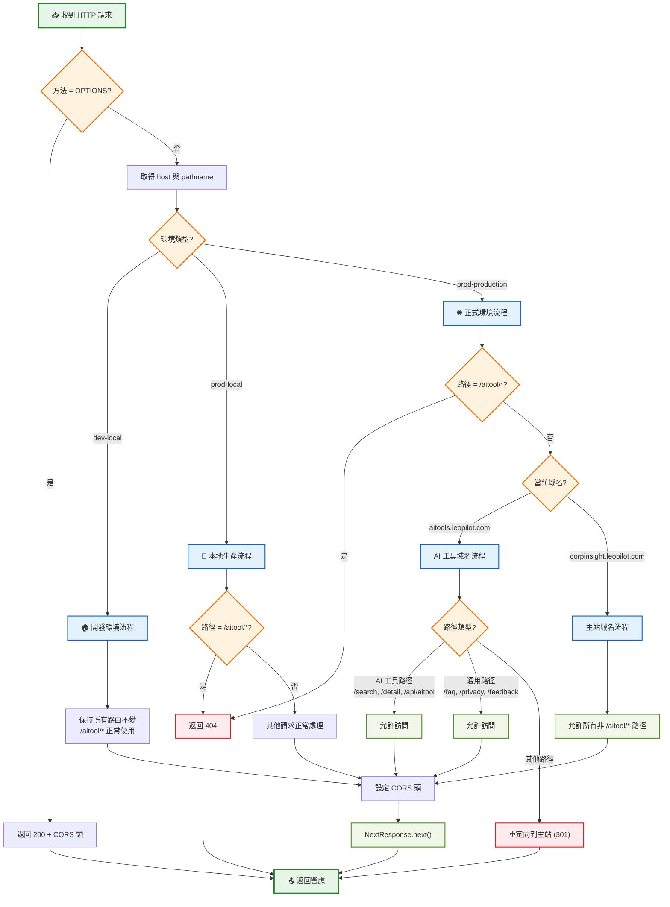

# 中介層路由決策樹

```mermaid
flowchart TD
    Start["📥 收到 HTTP 請求"] --> OptionsCheck{"方法 = OPTIONS?"}

    OptionsCheck -->|是| OptionsResponse["返回 200 + CORS 頭"]
    OptionsCheck -->|否| GetHost["取得 host 與 pathname"]

    GetHost --> EnvCheck{"環境類型?"}

    EnvCheck -->|dev-local| DevFlow["🏠 開發環境流程"]
    EnvCheck -->|prod-local| ProdLocalFlow["🔧 本地生產流程"]
    EnvCheck -->|prod-production| ProdFlow["🌐 正式環境流程"]

    DevFlow --> DevProcess["保持所有路由不變<br/>/aitool/* 正常使用"]
    DevProcess --> SetCORS["設定 CORS 頭"]
    SetCORS --> NextResponse["NextResponse.next()"]

    ProdLocalFlow --> BlockCheck{"路徑 = /aitool/*?"}
    BlockCheck -->|是| Block404["返回 404"]
    BlockCheck -->|否| ProdLocalProcess["其他請求正常處理"]
    ProdLocalProcess --> SetCORS

    ProdFlow --> ProdBlockCheck{"路徑 = /aitool/*?"}
    ProdBlockCheck -->|是| Block404
    ProdBlockCheck -->|否| DomainCheck{"當前域名?"}

    DomainCheck -->|aitools.leopilot.com| AIToolsDomainFlow["AI 工具域名流程"]
    DomainCheck -->|corpinsight.leopilot.com| MainDomainFlow["主站域名流程"]

    AIToolsDomainFlow --> PathCheck{"路徑類型?"}
    PathCheck -->|AI 工具路徑<br/>/search, /detail, /api/aitool| AllowAITools["允許訪問"]
    PathCheck -->|通用路徑<br/>/faq, /privacy, /feedback| AllowUniversal["允許訪問"]
    PathCheck -->|其他路徑| RedirectMain["重定向到主站 (301)"]

    MainDomainFlow --> AllowMain["允許所有非 /aitool/* 路徑"]

    AllowAITools --> SetCORS
    AllowUniversal --> SetCORS
    AllowMain --> SetCORS
    RedirectMain --> End
    Block404 --> End
    OptionsResponse --> End
    NextResponse --> End["📤 返回響應"]

    classDef startClass fill:#e8f5e9,stroke:#2e7d32,stroke-width:3px
    classDef decisionClass fill:#fff3e0,stroke:#ef6c00,stroke-width:2px
    classDef processClass fill:#e3f2fd,stroke:#1565c0,stroke-width:2px
    classDef errorClass fill:#ffebee,stroke:#c62828,stroke-width:2px
    classDef successClass fill:#f1f8e9,stroke:#558b2f,stroke-width:2px

    class Start,End startClass
    class OptionsCheck,EnvCheck,BlockCheck,ProdBlockCheck,DomainCheck,PathCheck decisionClass
    class DevFlow,ProdLocalFlow,ProdFlow,AIToolsDomainFlow,MainDomainFlow processClass
    class Block404,RedirectMain errorClass
    class AllowAITools,AllowUniversal,AllowMain,NextResponse successClass
```
