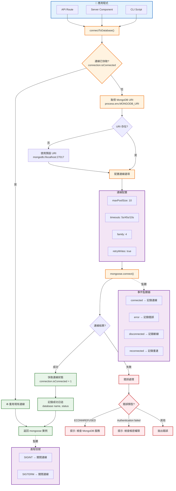

# 資料庫連線管理

```mermaid
flowchart TD
    subgraph Application["🚀 應用程式"]
        APIRoute["API Route"]
        ServerComponent["Server Component"]
        Script["CLI Script"]
    end

    APIRoute --> ConnectDB["connectToDatabase()"]
    ServerComponent --> ConnectDB
    Script --> ConnectDB

    ConnectDB --> CheckCache{"連線已快取?<br/>connection.isConnected"}

    CheckCache -->|是| ReuseConn["♻️ 重用現有連線"]
    CheckCache -->|否| GetURI["取得 MongoDB URI<br/>process.env.MONGODB_URI"]

    GetURI --> URICheck{"URI 存在?"}
    URICheck -->|否| DefaultURI["使用預設 URI<br/>mongodb://localhost:27017"]
    URICheck -->|是| ConfigOpts["配置連線選項"]
    DefaultURI --> ConfigOpts

    subgraph ConnOptions["連線配置"]
        MaxPool["maxPoolSize: 10"]
        Timeout["timeouts: 5s/45s/10s"]
        IPv4["family: 4"]
        Retry["retryWrites: true"]
    end

    ConfigOpts --> ConnOptions
    ConnOptions --> Connect["mongoose.connect()"]

    Connect --> ConnResult{"連線結果?"}

    ConnResult -->|成功| CacheConn["快取連線狀態<br/>connection.isConnected = 1"]
    ConnResult -->|失敗| ErrorHandle["錯誤處理"]

    ErrorHandle --> ErrorType{"錯誤類型?"}
    ErrorType -->|ECONNREFUSED| RefusedMsg["提示: 檢查 MongoDB 服務"]
    ErrorType -->|Authentication failed| AuthMsg["提示: 檢查帳密權限"]
    ErrorType -->|其他| ThrowError["拋出錯誤"]

    CacheConn --> LogSuccess["記錄成功日誌<br/>database name, status"]
    ReuseConn --> Return["返回 mongoose 實例"]
    LogSuccess --> Return

    subgraph Listeners["事件監聽器"]
        OnConnected["connected → 記錄連線"]
        OnError["error → 記錄錯誤"]
        OnDisconnected["disconnected → 記錄斷線"]
        OnReconnected["reconnected → 記錄重連"]
    end

    subgraph Signals["進程信號"]
        SIGINT["SIGINT → 關閉連線"]
        SIGTERM["SIGTERM → 關閉連線"]
    end

    Connect -.監聽.-> Listeners
    Return -.監聽.-> Signals

    classDef appClass fill:#e3f2fd,stroke:#1565c0,stroke-width:2px
    classDef processClass fill:#fff3e0,stroke:#ef6c00,stroke-width:2px
    classDef successClass fill:#e8f5e9,stroke:#2e7d32,stroke-width:2px
    classDef errorClass fill:#ffebee,stroke:#c62828,stroke-width:2px
    classDef configClass fill:#f3e5f5,stroke:#6a1b9a,stroke-width:2px

    class Application appClass
    class ConnectDB,CheckCache,GetURI,ConfigOpts,Connect processClass
    class ReuseConn,CacheConn,LogSuccess,Return successClass
    class ErrorHandle,ErrorType,RefusedMsg,AuthMsg,ThrowError errorClass
    class ConnOptions,Listeners,Signals configClass
```
