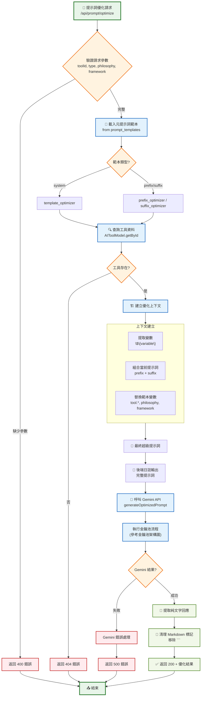

# AI 工具提示詞優化流程

```mermaid
flowchart TD
    Start["🎯 提示詞優化請求<br/>/api/prompt/optimize"] --> ValidateReq{"驗證請求參數<br/>toolId, type, philosophy, framework"}

    ValidateReq -->|缺少參數| Error400["返回 400 錯誤"]
    ValidateReq -->|完整| LoadTemplate["📖 載入元提示詞範本<br/>from prompt_templates"]

    LoadTemplate --> TemplateType{"範本類型?"}
    TemplateType -->|system| SysTemplate["template_optimizer"]
    TemplateType -->|prefix/suffix| AffixTemplate["prefix_optimizer / suffix_optimizer"]

    SysTemplate --> QueryDB["🔍 查詢工具資料<br/>AIToolModel.getById"]
    AffixTemplate --> QueryDB

    QueryDB --> ToolExists{"工具存在?"}
    ToolExists -->|否| Error404["返回 404 錯誤"]
    ToolExists -->|是| BuildContext["🏗️ 建立優化上下文"]

    subgraph ContextBuilding["上下文建立"]
        ExtractVars["提取變數<br/>\$\{variable\}"]
        BuildCurrent["組合當前提示詞<br/>prefix + suffix"]
        ReplaceVars["替換範本變數<br/>tool.*, philosophy, framework"]
    end

    BuildContext --> ContextBuilding
    ContextBuilding --> FinalPrompt["🎯 最終超級提示詞"]

    FinalPrompt --> LogPrompt["📝 後端日誌輸出<br/>完整提示詞"]
    LogPrompt --> CallGemini["🤖 呼叫 Gemini API<br/>generateOptimizedPrompt"]

    CallGemini --> KeyPoolFlow["執行金鑰池流程<br/>(參考金鑰池架構圖)"]

    KeyPoolFlow --> GeminiResult{"Gemini 結果?"}
    GeminiResult -->|成功| ExtractText["📄 提取純文字回應"]
    GeminiResult -->|失敗| GeminiError["Gemini 錯誤處理"]

    ExtractText --> CleanText["🧹 清理 Markdown 標記<br/>移除 ```"]
    CleanText --> Return200["✅ 返回 200 + 優化結果"]

    GeminiError --> Error500["返回 500 錯誤"]

    Error400 --> End
    Error404 --> End
    Error500 --> End
    Return200 --> End["📤 結束"]

    classDef startClass fill:#e8f5e9,stroke:#2e7d32,stroke-width:3px
    classDef processClass fill:#e3f2fd,stroke:#1565c0,stroke-width:2px
    classDef decisionClass fill:#fff3e0,stroke:#ef6c00,stroke-width:2px
    classDef errorClass fill:#ffebee,stroke:#c62828,stroke-width:2px
    classDef successClass fill:#f1f8e9,stroke:#558b2f,stroke-width:2px

    class Start,End startClass
    class LoadTemplate,QueryDB,BuildContext,CallGemini,KeyPoolFlow processClass
    class ValidateReq,TemplateType,ToolExists,GeminiResult decisionClass
    class Error400,Error404,Error500,GeminiError errorClass
    class Return200,ExtractText,CleanText successClass
```
