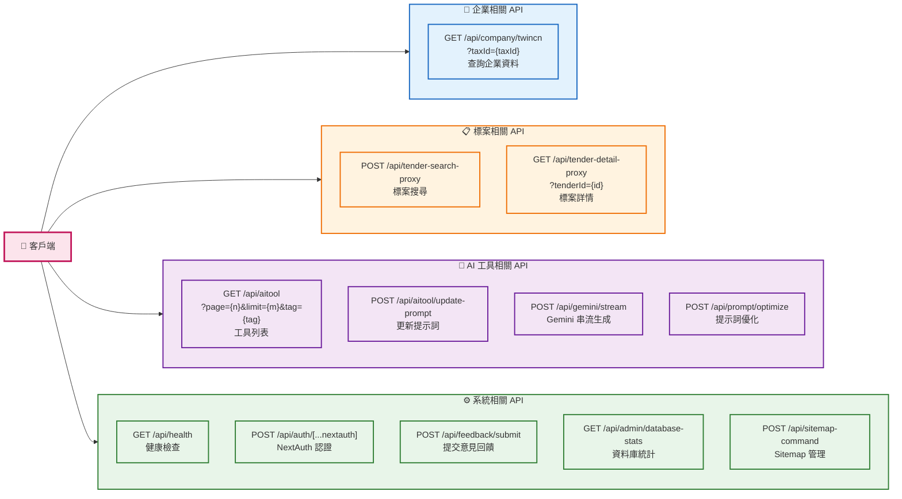

# API 端點總覽

```mermaid
graph LR
    subgraph CompanyAPI["🏢 企業相關 API"]
        Company1["GET /api/company/twincn<br/>?taxId={taxId}<br/>查詢企業資料"]
    end

    subgraph TenderAPI["📋 標案相關 API"]
        Tender1["POST /api/tender-search-proxy<br/>標案搜尋"]
        Tender2["GET /api/tender-detail-proxy<br/>?tenderId={id}<br/>標案詳情"]
    end

    subgraph AIToolAPI["🤖 AI 工具相關 API"]
        AI1["GET /api/aitool<br/>?page={n}&limit={m}&tag={tag}<br/>工具列表"]
        AI2["POST /api/aitool/update-prompt<br/>更新提示詞"]
        AI3["POST /api/gemini/stream<br/>Gemini 串流生成"]
        AI4["POST /api/prompt/optimize<br/>提示詞優化"]
    end

    subgraph SystemAPI["⚙️ 系統相關 API"]
        System1["GET /api/health<br/>健康檢查"]
        System2["POST /api/auth/[...nextauth]<br/>NextAuth 認證"]
        System3["POST /api/feedback/submit<br/>提交意見回饋"]
        System4["GET /api/admin/database-stats<br/>資料庫統計"]
        System5["POST /api/sitemap-command<br/>Sitemap 管理"]
    end

    Client["👤 客戶端"] --> CompanyAPI
    Client --> TenderAPI
    Client --> AIToolAPI
    Client --> SystemAPI

    classDef companyClass fill:#e3f2fd,stroke:#1565c0,stroke-width:2px
    classDef tenderClass fill:#fff3e0,stroke:#ef6c00,stroke-width:2px
    classDef aiClass fill:#f3e5f5,stroke:#6a1b9a,stroke-width:2px
    classDef systemClass fill:#e8f5e9,stroke:#2e7d32,stroke-width:2px
    classDef clientClass fill:#fce4ec,stroke:#c2185b,stroke-width:3px

    class CompanyAPI,Company1 companyClass
    class TenderAPI,Tender1,Tender2 tenderClass
    class AIToolAPI,AI1,AI2,AI3,AI4 aiClass
    class SystemAPI,System1,System2,System3,System4,System5 systemClass
    class Client clientClass
```
