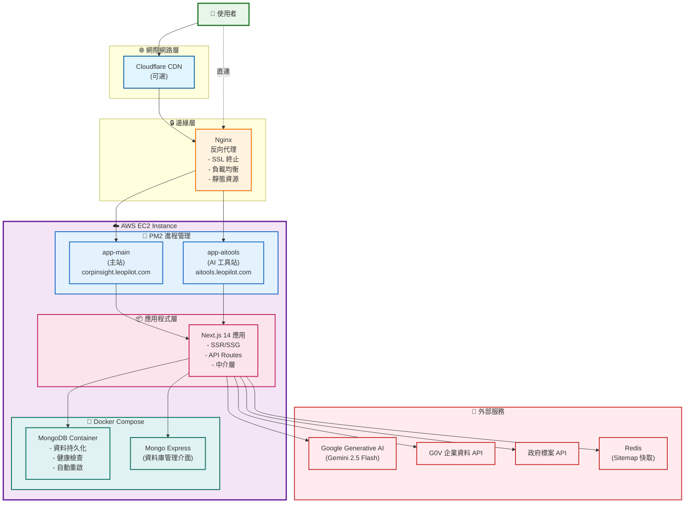

# 部署架構

```mermaid
flowchart TD
    User["👥 使用者"]

    subgraph Internet["🌐 網際網路層"]
        CDN["Cloudflare CDN<br/>(可選)"]
    end

    subgraph EdgeLayer["🔒 邊緣層"]
        Nginx["Nginx<br/>反向代理<br/>- SSL 終止<br/>- 負載均衡<br/>- 靜態資源"]
    end

    subgraph EC2["☁️ AWS EC2 Instance"]
        direction TB

        subgraph PM2Layer["🔄 PM2 進程管理"]
            direction LR
            PM2Main["app-main<br/>(主站)<br/>corpinsight.leopilot.com"]
            PM2AITools["app-aitools<br/>(AI 工具站)<br/>aitools.leopilot.com"]
        end

        subgraph DockerLayer["🐳 Docker Compose"]
            direction LR
            MongoDB["MongoDB Container<br/>- 資料持久化<br/>- 健康檢查<br/>- 自動重啟"]
            MongoExpress["Mongo Express<br/>(資料庫管理介面)"]
        end

        subgraph AppLayer["📦 應用程式層"]
            NextApp["Next.js 14 應用<br/>- SSR/SSG<br/>- API Routes<br/>- 中介層"]
        end
    end

    subgraph ExternalServices["🔌 外部服務"]
        GeminiAPI["Google Generative AI<br/>(Gemini 2.5 Flash)"]
        G0VAPI["G0V 企業資料 API"]
        TenderAPI["政府標案 API"]
        RedisCloud["Redis<br/>(Sitemap 快取)"]
    end

    User --> CDN
    CDN --> Nginx
    User -.直連.-> Nginx

    Nginx --> PM2Main
    Nginx --> PM2AITools

    PM2Main --> NextApp
    PM2AITools --> NextApp

    NextApp --> MongoDB
    NextApp --> MongoExpress
    NextApp --> GeminiAPI
    NextApp --> G0VAPI
    NextApp --> TenderAPI
    NextApp --> RedisCloud

    classDef userClass fill:#e8f5e9,stroke:#2e7d32,stroke-width:3px
    classDef cdnClass fill:#e1f5fe,stroke:#01579b,stroke-width:2px
    classDef proxyClass fill:#fff3e0,stroke:#ef6c00,stroke-width:2px
    classDef ec2Class fill:#f3e5f5,stroke:#6a1b9a,stroke-width:3px
    classDef pm2Class fill:#e3f2fd,stroke:#1565c0,stroke-width:2px
    classDef dockerClass fill:#e0f2f1,stroke:#00695c,stroke-width:2px
    classDef appClass fill:#fce4ec,stroke:#c2185b,stroke-width:2px
    classDef externalClass fill:#ffebee,stroke:#c62828,stroke-width:2px

    class User userClass
    class CDN cdnClass
    class Nginx proxyClass
    class EC2 ec2Class
    class PM2Layer,PM2Main,PM2AITools pm2Class
    class DockerLayer,MongoDB,MongoExpress dockerClass
    class AppLayer,NextApp appClass
    class ExternalServices,GeminiAPI,G0VAPI,TenderAPI,RedisCloud externalClass
```
