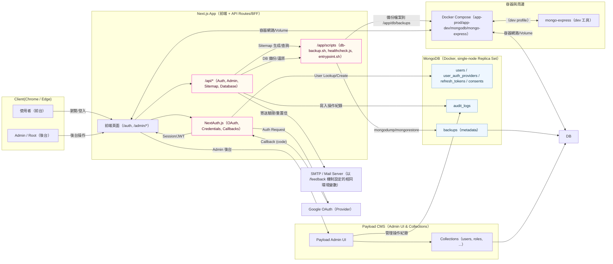

# 系統架構圖（Mermaid 文字版）

以下以 Mermaid 流程/元件圖描述整體系統（瀏覽器、Next.js App、NextAuth.js、Payload CMS、MongoDB、SMTP、容器/腳本）。若你需要 SVG 版本，我可以再輸出為 SVG Artifact。

---

## 補充：資料流摘要

- 使用者登入（Google OAuth）：Client → NextAuth → Google → NextAuth Callback → 查/建 user（Mongo）→ 發放 Session/JWT。
- Email 驗證/重置：API 復用 /feedback 既有 mail util 與相同環境變數，寄送信件。
- 後台 Sitemap 與資料庫管理：Admin 操作 → API → 觸發容器內 scripts（sitemap 生成、mongodump/mongorestore）→ 更新 DB 與寫入 audit_logs。
- Payload CMS：作為後台 UI 與 Collections 定義，直接連接 MongoDB；與 Next.js App 共同存取 users 等資料。

---

## 相依與部署重點

- docker-compose profiles：dev（app-dev + mongo + mongo-express）、prod（app-prod + mongo）。
- Mongo 建議啟用 single-node replica set（./docker/mongodb/init/rs-init.js）。
- 備份路徑：/app/db/backups（權限控管、輪替策略）。
- 健康檢查：/api/health 回傳 DB 連線與應用狀態。
- 發信：務必沿用 /feedback 的 mail client 與環境變數（避免工具分裂）。
