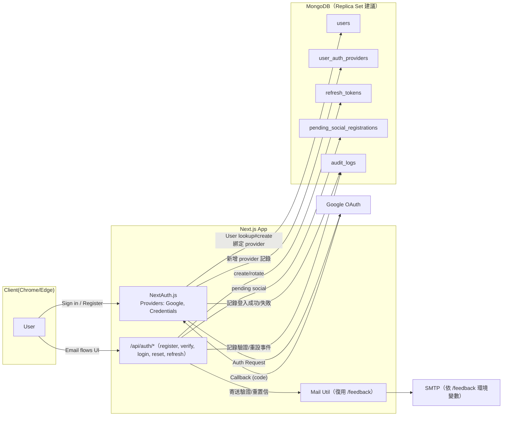

# 分解子系統圖（Mermaid 文字版）

說明：以下將系統拆解為多張子系統圖，涵蓋「認證/Auth」「後台/Admin」「Sitemap」「資料庫備份/還原」「郵件」「可觀測性/健康檢查」等。每張圖均延續既有 Docker 與程式結構，並強調和現有 /feedback、/admin/sitemap、/admin/database 的相容與復用。

---

## 1) 認證子系統（NextAuth + Users + Providers + Email 驗證）

重點：

- Access JWT 短存活（建議 15 分鐘）、Refresh Token 存 DB hash（旋轉 + 撤銷）。
- Provider 未提供 email → 進入 pending_social_registrations 並要求補信箱完成驗證。

---
