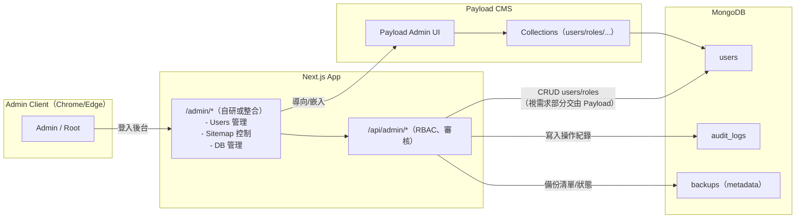

# 分解子系統圖（Mermaid 文字版）

說明：以下將系統拆解為多張子系統圖，涵蓋「認證/Auth」「後台/Admin」「Sitemap」「資料庫備份/還原」「郵件」「可觀測性/健康檢查」等。每張圖均延續既有 Docker 與程式結構，並強調和現有 /feedback、/admin/sitemap、/admin/database 的相容與復用。

---

## 2) 後台子系統（Admin/Root 儀表板 + Payload CMS）

重點：

- Admin UI 可選擇「整合 Payload UI」或「自建頁面」共存。
- RBAC 控管危險操作僅限特定權限（如 DB restore）。

---
