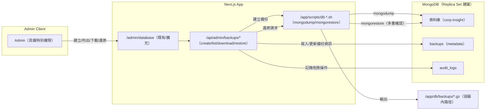

# 分解子系統圖（Mermaid 文字版）

說明：以下將系統拆解為多張子系統圖，涵蓋「認證/Auth」「後台/Admin」「Sitemap」「資料庫備份/還原」「郵件」「可觀測性/健康檢查」等。每張圖均延續既有 Docker 與程式結構，並強調和現有 /feedback、/admin/sitemap、/admin/database 的相容與復用。

---

## 4) 資料庫備份/還原子系統（/admin/database 相容）

重點：

- Restore 為高風險 → 多重確認（輸入確認字串 + 二人審核可選）+ audit。
- 備份檔權限與輪替策略需設定；必要時加密。

---
