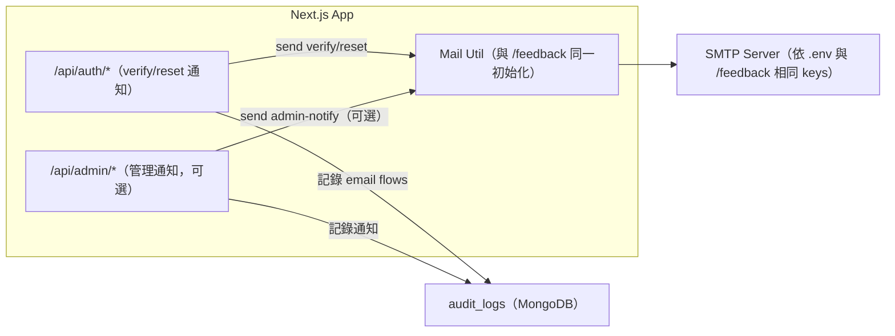

# 分解子系統圖（Mermaid 文字版）

說明：以下將系統拆解為多張子系統圖，涵蓋「認證/Auth」「後台/Admin」「Sitemap」「資料庫備份/還原」「郵件」「可觀測性/健康檢查」等。每張圖均延續既有 Docker 與程式結構，並強調和現有 /feedback、/admin/sitemap、/admin/database 的相容與復用。

---

## 5) 郵件子系統（復用 /feedback 機制）

重點：

- 不引入第二套寄信工具；所有寄信走同一 util 與 env keys。
- 模板與 token 生成策略沿用現有實作（或抽象成共用）。

---
