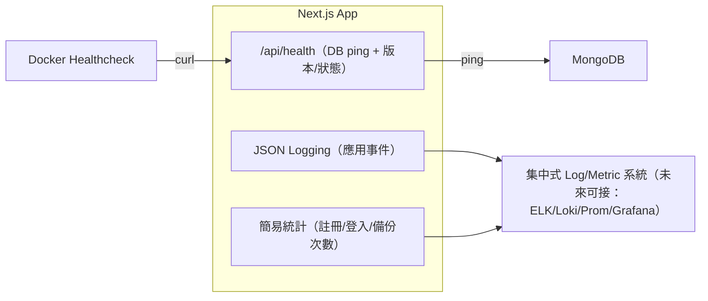

# 分解子系統圖（Mermaid 文字版）

說明：以下將系統拆解為多張子系統圖，涵蓋「認證/Auth」「後台/Admin」「Sitemap」「資料庫備份/還原」「郵件」「可觀測性/健康檢查」等。每張圖均延續既有 Docker 與程式結構，並強調和現有 /feedback、/admin/sitemap、/admin/database 的相容與復用。

---

## 6) 可觀測性與健康檢查子系統

重點：

- healthcheck 與 docker-compose 的 depends_on 配合，確保服務啟動序。
- 預留對接集中式觀測方案的擴充點。

---
