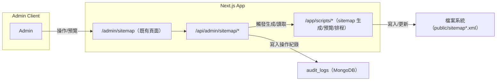

# 分解子系統圖（Mermaid 文字版）

說明：以下將系統拆解為多張子系統圖，涵蓋「認證/Auth」「後台/Admin」「Sitemap」「資料庫備份/還原」「郵件」「可觀測性/健康檢查」等。每張圖均延續既有 Docker 與程式結構，並強調和現有 /feedback、/admin/sitemap、/admin/database 的相容與復用。

---

## 3) Sitemap 子系統（/admin/sitemap 相容）

重點：

- 完全對照 /admin/sitemap 既有的按鈕與互動。
- 生成過程若耗時，使用 background job 或任務狀態輪詢。

---
