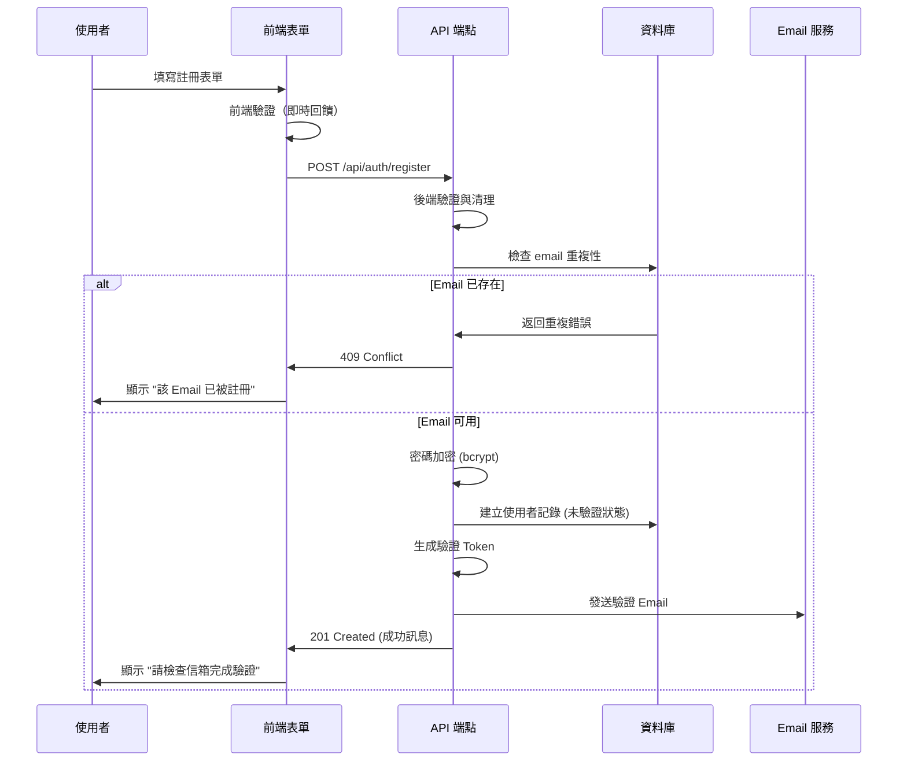
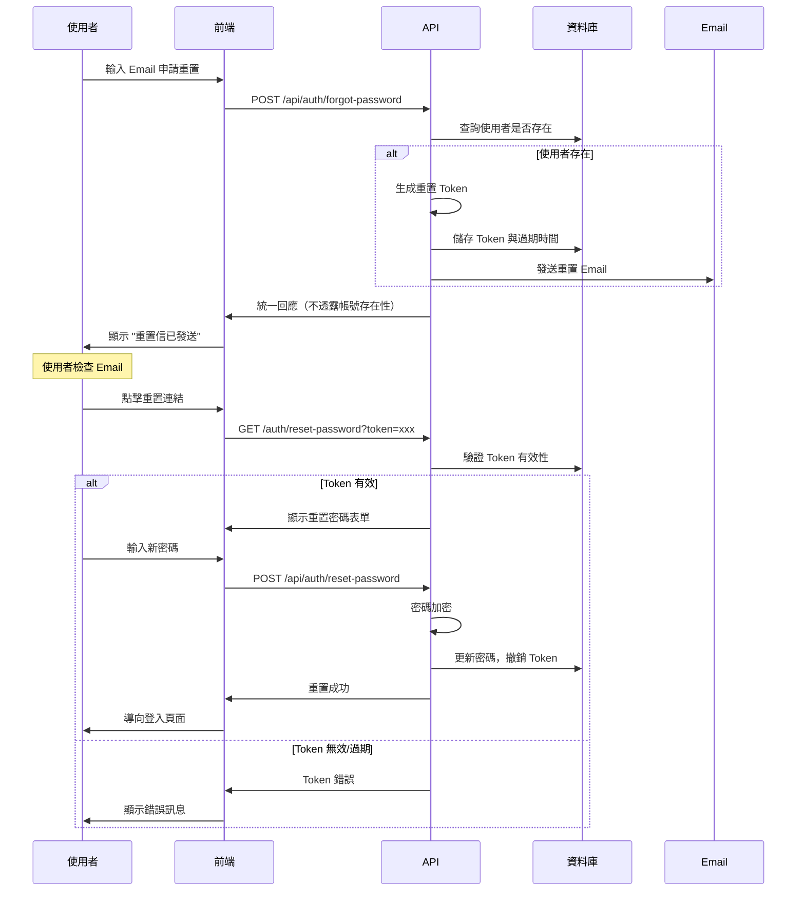

# 帳號管理需求

本文件定義會員系統的帳號管理功能需求，包含註冊、驗證、密碼管理等完整的使用者生命週期管理。

## 🎯 功能概述

### 核心帳號管理功能

1. **帳號註冊**：Email/密碼註冊與社交登入註冊
2. **Email 驗證**：新註冊帳號的 Email 驗證機制
3. **密碼管理**：忘記密碼、重置密碼、變更密碼
4. **個人資料管理**：基本資料維護與偏好設定
5. **帳號綁定**：多重社交帳號綁定管理
6. **帳號安全**：安全設定與活動記錄

### 技術架構整合

- **NextAuth.js**：核心認證框架
- **MongoDB**：使用者資料存儲
- **Email 系統**：沿用現有 feedback 系統的發送機制
- **安全機制**：密碼加密、Token 管理、CSRF 防護

## 📝 帳號註冊需求

### Email/密碼註冊流程

#### 註冊表單要求

```typescript
interface RegistrationForm {
  email: string; // 必填，Email 格式驗證
  password: string; // 必填，密碼強度驗證
  confirmPassword: string; // 必填，密碼確認
  name: string; // 必填，顯示名稱
  acceptTerms: boolean; // 必填，同意服務條款
  acceptPrivacy: boolean; // 必填，同意隱私政策
}
```

#### 註冊驗證規則

1. **Email 驗證**
   - 格式符合 RFC 5322 標準
   - 最大長度 254 字元
   - 不允許暫存信箱域名
   - 檢查是否已被註冊

2. **密碼強度要求**
   - 最少 8 字元，最多 128 字元
   - 包含大寫字母、小寫字母、數字、特殊字元
   - 不得為常見密碼（blacklist 檢查）
   - 不得包含 email 的 local part

3. **名稱驗證**
   - 最少 1 字元，最多 100 字元
   - 支援中文、英文、數字、部分特殊字元
   - 過濾惡意內容與 XSS

#### 註冊流程設計



### 社交登入註冊流程

#### Google OAuth 註冊

1. **完整資料流程**
   - 使用者授權 Google OAuth
   - 系統取得基本資料（email, name, picture）
   - 自動建立帳號（email_verified: true）
   - 導向歡迎頁面

2. **資料補完流程**
   - 當 Google 未提供 email 或 email 未驗證
   - 建立暫存註冊記錄
   - 要求使用者補填 email
   - 發送驗證信完成註冊

#### Line OAuth 特殊處理

```typescript
// Line OAuth 回調處理邏輯
async function handleLineCallback(profile: LineProfile) {
  if (!profile.email || !profile.email_verified) {
    // 建立暫存註冊
    const tempToken = generateSecureToken();
    await PendingRegistration.create({
      provider: 'line',
      providerProfile: profile,
      tempToken,
      expiresAt: new Date(Date.now() + 24 * 60 * 60 * 1000), // 24 小時
    });

    return {
      redirect: `/auth/complete-registration?token=${tempToken}`,
      message: '請補填 Email 完成註冊',
    };
  }

  // 正常註冊流程
  return await createUserFromSocialProfile(profile);
}
```

## ✉️ Email 驗證需求

### 驗證機制設計

#### 驗證 Token 管理

```typescript
interface EmailVerification {
  userId: string;
  token: string; // 32 字元隨機字串
  expiresAt: Date; // 24 小時後過期
  attempts: number; // 驗證嘗試次數
  createdAt: Date;
  lastAttemptAt?: Date;
}
```

#### 驗證流程

1. **發送驗證信**
   - 生成安全的隨機 Token
   - 儲存 Token 與使用者關聯
   - 使用現有 email 配置發送
   - 設定 24 小時過期時間

2. **驗證處理**
   - 驗證 Token 有效性與過期時間
   - 檢查嘗試次數（最多 5 次）
   - 更新使用者狀態為已驗證
   - 清除驗證 Token

3. **重發機制**
   - 使用者可要求重新發送
   - 撤銷舊 Token，生成新 Token
   - 24 小時內最多重發 3 次

#### Email 範本設計

```html
<!-- 驗證信範本 -->
<div style="font-family: Arial, sans-serif; max-width: 600px; margin: 0 auto;">
  <div style="background-color: #f8f9fa; padding: 20px; text-align: center;">
    <h1 style="color: #0056b3;">Corp Insight</h1>
  </div>

  <div style="padding: 30px 20px;">
    <h2 style="color: #333;">歡迎加入 Corp Insight！</h2>

    <p>親愛的 {{name}}，</p>

    <p>感謝您註冊 Corp Insight 帳號。請點擊下方按鈕驗證您的 Email 地址：</p>

    <div style="text-align: center; margin: 30px 0;">
      <a
        href="{{verificationUrl}}"
        style="background-color: #0056b3; color: white; padding: 12px 30px;
                text-decoration: none; border-radius: 5px; display: inline-block;"
      >
        驗證我的帳號
      </a>
    </div>

    <p>或複製以下連結到瀏覽器：</p>
    <p style="word-break: break-all; color: #666;">{{verificationUrl}}</p>

    <p style="font-size: 14px; color: #666; margin-top: 30px;">
      此連結將於 24 小時後過期。如果您沒有註冊帳號，請忽略此信。
    </p>
  </div>

  <div
    style="background-color: #f8f9fa; padding: 15px; text-align: center;
              font-size: 12px; color: #666;"
  >
    <p>&copy; {{year}} Corp Insight. All rights reserved.</p>
  </div>
</div>
```

## 🔐 密碼管理需求

### 忘記密碼流程

#### 請求重置密碼

```typescript
interface ForgotPasswordRequest {
  email: string; // 必填，註冊的 Email 地址
}
```

1. **安全性考量**
   - 不透露帳號是否存在
   - 統一回應：「如果該 Email 已註冊，重置信已發送」
   - 速率限制：同一 Email 15 分鐘內僅能申請 2 次

2. **重置 Token 管理**
   - 生成安全隨機 Token（32 字元）
   - 設定 1 小時過期時間
   - 一次性使用，使用後立即撤銷
   - 新申請會撤銷舊 Token

#### 重置密碼流程



### 變更密碼流程

#### 已登入使用者變更密碼

```typescript
interface ChangePasswordRequest {
  currentPassword: string; // 必填，當前密碼
  newPassword: string; // 必填，新密碼
  confirmPassword: string; // 必填，確認新密碼
}
```

1. **安全驗證**
   - 驗證當前密碼正確性
   - 新密碼不得與當前密碼相同
   - 新密碼符合密碼強度要求
   - 需要有效的登入 Session

2. **變更後處理**
   - 撤銷所有現有 Refresh Tokens（強制重新登入）
   - 記錄密碼變更事件（audit log）
   - 發送安全通知 Email
   - 更新密碼變更時間戳記

## 👤 個人資料管理需求

### 基本資料維護

#### 可編輯欄位

```typescript
interface UserProfile {
  // 基本資訊
  name: string; // 顯示名稱
  firstName?: string; // 名字
  lastName?: string; // 姓氏
  phone?: string; // 電話號碼
  company?: string; // 公司名稱
  jobTitle?: string; // 職稱

  // 系統偏好
  language: 'zh-TW' | 'en'; // 界面語言
  timezone: string; // 時區設定
  emailNotifications: boolean; // 是否接收通知信
}
```

#### 資料驗證規則

1. **名稱驗證**
   - 必填，1-100 字元
   - 支援中文、英文、數字
   - 過濾 HTML 標籤與特殊字元

2. **電話驗證**
   - 選填，支援國際格式
   - 格式：+886-912-345-678
   - 長度限制：8-20 字元

3. **公司與職稱**
   - 選填，最多 100 字元
   - 支援中英文混合
   - 過濾不當內容

### 偏好設定管理

#### 通知設定

```typescript
interface NotificationPreferences {
  emailNotifications: boolean; // Email 通知總開關
  securityAlerts: boolean; // 安全警報（建議強制開啟）
  productUpdates: boolean; // 產品更新通知
  marketingEmails: boolean; // 行銷郵件
}
```

#### 隱私設定

```typescript
interface PrivacySettings {
  profileVisibility: 'public' | 'private'; // 個人資料可見度
  showEmail: boolean; // 是否顯示 Email
  showPhone: boolean; // 是否顯示電話
  dataProcessingConsent: boolean; // 資料處理同意
}
```

## 🔗 社交帳號綁定需求

### 多重帳號綁定

#### 支援的提供者

1. **Google** - 主要支援，完整整合
2. **Facebook** - 次要支援
3. **Line** - 特殊處理（可能缺少 email）

#### 綁定流程

```typescript
// 帳號綁定狀態管理
interface LinkedAccount {
  provider: 'google' | 'facebook' | 'line';
  providerAccountId: string;
  connectedAt: Date;
  lastUsed?: Date;
  email?: string; // 提供者的 email（如果有）
  displayName?: string; // 提供者的顯示名稱
}
```

1. **新增綁定**
   - 使用者已登入狀態下發起 OAuth
   - 檢查該社交帳號是否已被其他使用者綁定
   - 成功後在 accounts 表新增記錄

2. **解除綁定**
   - 檢查是否為唯一登入方式
   - 如果有本地密碼或其他社交帳號，允許解除
   - 記錄解除綁定事件

3. **綁定限制**
   - 每個使用者最多綁定 3 個社交帳號
   - 同一社交帳號不能綁定多個使用者
   - 必須保留至少一種登入方式

## 🔒 帳號安全需求

### 安全設定

#### 登入活動記錄

```typescript
interface LoginActivity {
  timestamp: Date;
  ipAddress: string;
  userAgent: string;
  location?: string; // 基於 IP 的地理位置
  loginMethod: 'password' | 'google' | 'facebook' | 'line';
  success: boolean;
  failureReason?: string;
}
```

#### 安全事件通知

1. **自動通知情況**
   - 新設備登入
   - 異常地點登入
   - 密碼變更
   - 帳號綁定/解除

2. **通知方式**
   - Email 通知（即時）
   - 系統內通知（保留 30 天）

### 帳號安全功能

#### 主動安全措施

1. **異常登入檢測**
   - 不同地理位置的快速切換
   - 新設備或瀏覽器登入
   - 連續登入失敗

2. **自動保護機制**
   - 連續失敗 5 次鎖定帳號 15 分鐘
   - 異常活動自動要求重新驗證
   - 可疑操作要求 Email 確認

#### 使用者自助安全

```typescript
interface SecurityActions {
  // 查看登入活動記錄
  getLoginHistory(days?: number): Promise<LoginActivity[]>;

  // 撤銷所有 Sessions（除當前）
  revokeAllSessions(): Promise<void>;

  // 檢視目前活動的設備
  getActiveSessions(): Promise<ActiveSession[]>;

  // 撤銷特定設備 Session
  revokeSession(sessionId: string): Promise<void>;
}
```

## 📱 使用者體驗需求

### 介面設計要求

#### 響應式設計

- **桌面**：1200px+ 寬度優化
- **平板**：768px-1199px 適配
- **手機**：<768px 優化

#### 無障礙設計

- **鍵盤導航**：所有功能都可用鍵盤操作
- **螢幕閱讀器**：適當的 ARIA 標籤
- **色彩對比**：符合 WCAG 2.1 AA 標準

#### 錯誤處理 UX

```typescript
interface FormError {
  field: string;
  message: string;
  type: 'validation' | 'server' | 'network';
}

// 即時驗證回饋
const validationFeedback = {
  email: {
    valid: '✓ Email 格式正確',
    invalid: '✗ 請輸入有效的 Email 地址',
    taken: '✗ 此 Email 已被註冊',
  },
  password: {
    weak: '⚠ 密碼強度不足',
    medium: '⚠ 密碼強度中等',
    strong: '✓ 密碼強度良好',
  },
};
```

### 效能要求

#### 載入時間目標

- **首次載入**：< 3 秒
- **表單提交**：< 2 秒
- **頁面切換**：< 1 秒

#### 網路適應性

- **慢速網路**：優雅降級
- **離線狀態**：顯示適當訊息
- **重連機制**：自動重試失敗請求

---

**相關文件：**

- [API 設計規格](./api-specifications.md)
- [安全合規規格](./security-compliance.md)
- [使用者角色定義](./user-roles.md)
- [資料模型規格](./data-models.md)
