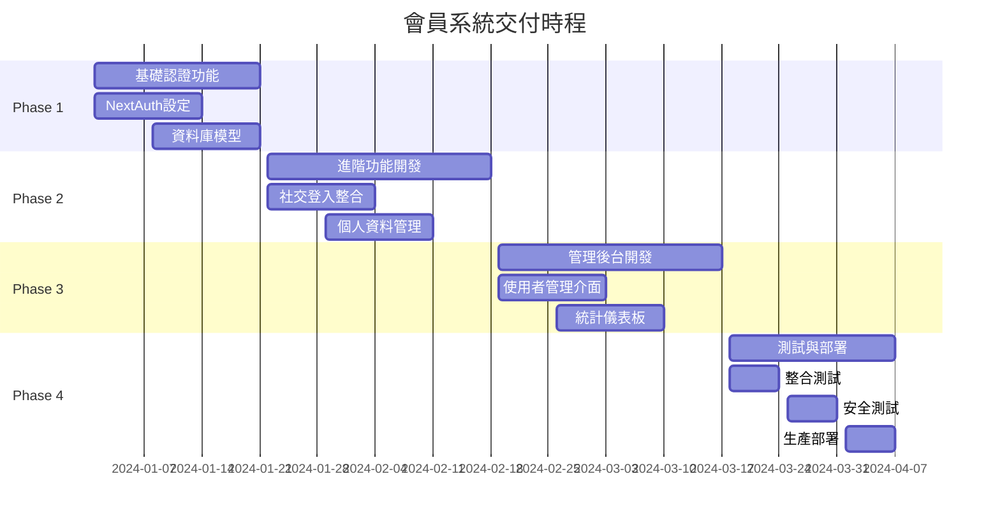

# 交付物清單

## 🚨 **BROWNFIELD 開發約束** 🚨

**⚠️ 此交付物清單必須遵循全專案 Brownfield 約束：**
**[../../../BROWNFIELD-DEVELOPMENT-CONSTRAINTS.md](../../../BROWNFIELD-DEVELOPMENT-CONSTRAINTS.md)**

---

本文件詳細列出會員系統開發的所有交付物，包含程式碼、文件、測試、部署配置等完整清單，確保專案交付品質與完整性。

## 📋 交付物總覽

### 🎯 主要交付分類

1. **前端交付物** - Next.js 頁面與元件
2. **後端交付物** - API 端點與中介軟體
3. **資料庫交付物** - 資料模型與索引設定
4. **配置交付物** - 環境變數與部署設定
5. **文件交付物** - 技術文件與使用手冊
6. **測試交付物** - 測試程式碼與測試報告
7. **安全交付物** - 安全設定與合規報告

### 📊 交付物統計

```
總交付物數量: 89 個
├── 程式碼檔案: 52 個
├── 配置檔案: 12 個
├── 文件檔案: 15 個
├── 測試檔案: 8 個
└── 其他檔案: 2 個
```

## 🎨 前端交付物

### 認證頁面與元件

```
src/app/(auth)/
├── login/
│   ├── page.tsx                 # 登入頁面
│   └── loading.tsx              # 登入載入狀態
├── register/
│   ├── page.tsx                 # 註冊頁面
│   └── loading.tsx              # 註冊載入狀態
├── verify-email/
│   └── page.tsx                 # Email 驗證頁面
├── forgot-password/
│   └── page.tsx                 # 忘記密碼頁面
├── reset-password/
│   └── page.tsx                 # 重置密碼頁面
└── auth-error/
    └── page.tsx                 # 認證錯誤頁面
```

### 會員中心頁面

```
src/app/(protected)/profile/
├── page.tsx                     # 個人資料頁面
├── security/
│   └── page.tsx                 # 安全設定頁面
├── linked-accounts/
│   └── page.tsx                 # 連結帳號管理
└── preferences/
    └── page.tsx                 # 偏好設定頁面
```

### 前端元件庫

```
src/components/auth/
├── LoginForm.tsx                # 登入表單元件
├── RegisterForm.tsx             # 註冊表單元件
├── SocialLoginButtons.tsx       # 社交登入按鈕群組
├── PasswordStrengthMeter.tsx    # 密碼強度檢測器
├── EmailVerificationBanner.tsx  # Email 驗證提示橫幅
├── TwoFactorSetup.tsx          # 雙因素認證設定
└── AuthGuard.tsx               # 認證保護元件

src/components/profile/
├── ProfileEditForm.tsx          # 個人資料編輯表單
├── SecuritySettings.tsx         # 安全設定面板
├── LinkedAccountsManager.tsx    # 連結帳號管理器
├── SessionsViewer.tsx          # 登入會話檢視器
└── PreferencesPanel.tsx        # 偏好設定面板
```

### 管理後台元件

```
src/components/admin/UserManagement/
├── UserListTable.tsx            # 會員列表表格
├── UserDetailCard.tsx           # 會員詳細資訊卡片
├── UserSearchFilter.tsx         # 會員搜尋篩選器
├── UserStatusManager.tsx        # 會員狀態管理器
├── UserPermissionEditor.tsx     # 權限編輯器
├── BatchOperationPanel.tsx      # 批量操作面板
└── UserActivityTimeline.tsx     # 使用者活動時間軸

src/components/admin/Dashboard/
├── UserStatsDashboard.tsx       # 會員統計儀表板
├── SecurityStatCard.tsx         # 安全統計卡片
├── ActivityTimeline.tsx         # 活動時間軸
├── RegistrationTrendChart.tsx   # 註冊趨勢圖表
└── LoginAnalyticsChart.tsx      # 登入分析圖表
```

## 🔧 後端交付物

### NextAuth.js 配置

```
src/app/api/auth/
├── [...nextauth]/
│   └── route.ts                 # NextAuth 主要配置
├── providers/
│   ├── google/
│   │   └── route.ts             # Google OAuth 提供者
│   ├── facebook/
│   │   └── route.ts             # Facebook OAuth 提供者
│   └── line/
│       └── route.ts             # Line OAuth 提供者
└── callbacks/
    ├── signin.ts                # 登入回調處理
    ├── session.ts               # Session 回調處理
    └── jwt.ts                   # JWT 回調處理
```

### 會員管理 API

```
src/app/api/users/
├── route.ts                     # 使用者列表/建立
├── [id]/
│   ├── route.ts                 # 使用者詳細/更新/刪除
│   ├── profile/route.ts         # 個人資料管理
│   ├── security/route.ts        # 安全設定管理
│   ├── sessions/route.ts        # Session 管理
│   └── linked-accounts/route.ts # 連結帳號管理
├── verify-email/route.ts        # Email 驗證
├── resend-verification/route.ts # 重新發送驗證信
├── forgot-password/route.ts     # 忘記密碼
├── reset-password/route.ts      # 重置密碼
└── change-password/route.ts     # 變更密碼
```

### 管理後台 API

```
src/app/api/admin/users/
├── route.ts                     # 會員列表/建立
├── [id]/
│   ├── route.ts                 # 會員詳細/更新/刪除
│   ├── status/route.ts          # 狀態管理
│   ├── permissions/route.ts     # 權限管理
│   └── sessions/route.ts        # Session 管理
├── dashboard/route.ts           # 統計儀表板
├── audit-logs/route.ts          # 審計記錄
├── batch-operations/route.ts    # 批量操作
└── export/route.ts              # 資料匯出
```

### 中介軟體與工具

```
src/lib/
├── auth/
│   ├── nextauth-config.ts       # NextAuth 完整配置
│   ├── auth-options.ts          # 認證選項設定
│   ├── providers-config.ts      # OAuth 提供者配置
│   ├── jwt-handler.ts           # JWT 處理工具
│   └── session-manager.ts       # Session 管理工具
├── middleware/
│   ├── auth-guard.ts            # 認證保護中介軟體
│   ├── admin-guard.ts           # 管理員權限檢查
│   ├── rate-limiter.ts          # 頻率限制中介軟體
│   └── audit-logger.ts          # 審計記錄中介軟體
└── utils/
    ├── password-validator.ts    # 密碼驗證工具
    ├── email-sender.ts          # Email 發送工具
    └── security-utils.ts        # 安全工具函數
```

## 🗄️ 資料庫交付物

### MongoDB 資料模型

```
src/lib/models/
├── User.ts                      # 使用者資料模型
├── Account.ts                   # OAuth 帳號模型
├── Session.ts                   # Session 資料模型
├── VerificationToken.ts         # 驗證 Token 模型
├── UserProfile.ts               # 使用者個人資料模型
├── AdminOperationLog.ts         # 管理員操作記錄模型
└── UserActivityLog.ts           # 使用者活動記錄模型
```

### 資料庫索引與初始化

```
db/migrations/
├── 001_create_users_collection.js      # 建立使用者集合
├── 002_create_accounts_collection.js   # 建立帳號集合
├── 003_create_sessions_collection.js   # 建立 Session 集合
├── 004_create_indexes.js               # 建立所有索引
├── 005_create_admin_user.js            # 建立初始管理員
└── 006_setup_audit_collections.js     # 建立審計記錄集合

db/indexes/
├── users-indexes.json          # 使用者集合索引定義
├── sessions-indexes.json       # Session 集合索引定義
└── audit-indexes.json          # 審計集合索引定義
```

### 資料庫腳本

```
scripts/db/
├── init-membership-db.js       # 初始化會員系統資料庫
├── migrate-users.js            # 使用者資料遷移
├── cleanup-expired-sessions.js # 清理過期 Session
└── backup-user-data.js         # 備份使用者資料
```

## ⚙️ 配置交付物

### 環境變數配置

```
# NextAuth 認證配置
NEXTAUTH_SECRET=                 # NextAuth 密鑰
NEXTAUTH_URL=                    # 應用程式 URL
NEXTAUTH_JWT_SECRET=             # JWT 簽名密鑰

# OAuth 提供者配置
GOOGLE_CLIENT_ID=                # Google OAuth Client ID
GOOGLE_CLIENT_SECRET=            # Google OAuth Client Secret
FACEBOOK_CLIENT_ID=              # Facebook App ID
FACEBOOK_CLIENT_SECRET=          # Facebook App Secret
LINE_CLIENT_ID=                  # Line Channel ID
LINE_CLIENT_SECRET=              # Line Channel Secret

# Email 服務配置
SMTP_HOST=                       # SMTP 伺服器
SMTP_PORT=                       # SMTP 埠號
SMTP_USER=                       # SMTP 使用者名稱
SMTP_PASSWORD=                   # SMTP 密碼
FROM_EMAIL=                      # 發信人地址

# 安全配置
BCRYPT_ROUNDS=12                 # 密碼加密輪數
SESSION_MAX_AGE=86400           # Session 最大存活時間
PASSWORD_MIN_LENGTH=8            # 密碼最小長度
MAX_LOGIN_ATTEMPTS=5             # 最大登入嘗試次數

# 管理後台配置
ADMIN_SECRET_TOKEN=              # 管理員存取密鑰
ROOT_USER_EMAIL=                 # Root 使用者 Email
```

### Docker 配置

```
docker/
├── Dockerfile.membership        # 會員系統 Docker 映像
├── docker-compose.auth.yml     # 認證服務 Docker Compose
└── nginx/
    └── auth.conf               # 認證相關 Nginx 配置
```

### Next.js 配置更新

```
next.config.js                   # Next.js 配置更新（認證相關）
middleware.ts                    # Next.js 中介軟體配置
```

## 📚 文件交付物

### PRD 規格文件

```
docs/features/membership-system/prd/
├── README.md                    # 專案總覽文件
├── user-roles.md               # 使用者角色定義
├── data-models.md              # 資料模型規格
├── api-specifications.md       # API 設計規格
├── development-priorities.md   # 開發優先順序
├── security-compliance.md      # 安全合規規格
├── account-management.md       # 帳號管理需求
├── admin-requirements.md       # 後台管理需求
├── test-cases.md              # 測試案例規格
└── deliverables.md            # 交付物清單（本文件）
```

### 技術文件

```
docs/features/membership-system/technical/
├── architecture-diagram.md     # 系統架構圖
├── database-schema.md          # 資料庫結構說明
├── api-documentation.md        # API 使用文件
├── security-implementation.md  # 安全實作說明
└── deployment-guide.md         # 部署指南
```

### 使用手冊

```
docs/features/membership-system/user-guides/
├── admin-user-manual.md        # 管理員使用手冊
├── end-user-guide.md           # 終端使用者指南
├── troubleshooting.md          # 問題排除指南
└── api-integration-guide.md    # API 整合指南
```

## 🧪 測試交付物

### 單元測試

```
tests/unit/
├── auth/
│   ├── nextauth-config.test.ts  # NextAuth 配置測試
│   ├── password-validator.test.ts # 密碼驗證測試
│   └── jwt-handler.test.ts       # JWT 處理測試
├── api/
│   ├── users.test.ts            # 使用者 API 測試
│   └── admin-users.test.ts      # 管理員 API 測試
└── components/
    ├── LoginForm.test.tsx       # 登入表單測試
    └── RegisterForm.test.tsx    # 註冊表單測試
```

### 整合測試

```
tests/integration/
├── auth-flow.test.ts           # 認證流程測試
├── oauth-providers.test.ts     # OAuth 提供者測試
├── email-verification.test.ts  # Email 驗證測試
└── admin-operations.test.ts    # 管理操作測試
```

### E2E 測試

```
tests/e2e/
├── user-registration.spec.ts   # 使用者註冊 E2E 測試
├── user-login.spec.ts          # 使用者登入 E2E 測試
├── password-reset.spec.ts      # 密碼重置 E2E 測試
└── admin-user-management.spec.ts # 管理員操作 E2E 測試
```

### 測試配置

```
jest.config.js                  # Jest 測試配置
playwright.config.ts            # Playwright E2E 測試配置
```

## 🔒 安全交付物

### 安全配置檔案

```
security/
├── csp-policy.json             # Content Security Policy
├── rate-limiting.json          # 頻率限制配置
└── security-headers.json       # 安全標頭配置
```

### 合規報告

```
compliance/
├── gdpr-compliance-report.md   # GDPR 合規報告
├── security-audit-checklist.md # 安全稽核檢查表
└── penetration-test-report.md  # 滲透測試報告
```

## 📈 品質保證交付物

### 程式碼品質

```
.eslintrc.membership.json       # ESLint 配置（會員系統專用）
.prettierrc.membership.json     # Prettier 配置
sonar-project.properties        # SonarQube 專案設定
```

### 測試報告

```
reports/
├── test-coverage-report.html   # 測試覆蓋率報告
├── performance-test-report.pdf # 效能測試報告
├── security-scan-report.json   # 安全掃描報告
└── accessibility-audit.html    # 無障礙稽核報告
```

## 🚀 部署交付物

### CI/CD 配置

```
.github/workflows/
├── membership-test.yml         # 會員系統測試工作流程
├── membership-deploy.yml       # 會員系統部署工作流程
└── security-scan.yml          # 安全掃描工作流程
```

### 部署腳本

```
scripts/deployment/
├── deploy-membership.sh       # 會員系統部署腳本
├── rollback-membership.sh     # 回滾腳本
├── health-check.sh            # 健康檢查腳本
└── migrate-production.sh      # 生產環境遷移腳本
```

## 📋 交付檢查清單

### 開發階段檢查

- [ ] **程式碼完成度**
  - [ ] 所有前端頁面與元件實作完成
  - [ ] 所有後端 API 端點實作完成
  - [ ] NextAuth.js 完整配置
  - [ ] 資料庫模型與索引建立完成

- [ ] **功能完整性**
  - [ ] 使用者註冊、登入、登出功能
  - [ ] Email 驗證與密碼重置功能
  - [ ] OAuth 社交登入功能
  - [ ] 管理後台會員管理功能
  - [ ] 個人資料與安全設定功能

### 測試階段檢查

- [ ] **測試覆蓋率**
  - [ ] 單元測試覆蓋率 ≥ 85%
  - [ ] API 測試覆蓋率 ≥ 90%
  - [ ] E2E 測試涵蓋主要使用者流程

- [ ] **效能測試**
  - [ ] API 響應時間 < 500ms
  - [ ] 頁面載入時間 < 3s
  - [ ] 並發使用者負載測試通過

### 安全階段檢查

- [ ] **安全實作**
  - [ ] 密碼加密與強度驗證
  - [ ] CSRF 保護
  - [ ] XSS 防護
  - [ ] SQL Injection 防護
  - [ ] 頻率限制實作

- [ ] **合規檢查**
  - [ ] GDPR 資料保護合規
  - [ ] Cookie 政策實作
  - [ ] 隱私政策更新
  - [ ] 使用者同意機制

### 部署階段檢查

- [ ] **環境配置**
  - [ ] 生產環境變數設定
  - [ ] 資料庫連線與索引
  - [ ] SSL 憑證配置
  - [ ] CDN 與快取設定

- [ ] **監控配置**
  - [ ] 應用程式效能監控
  - [ ] 錯誤追蹤與報警
  - [ ] 安全事件監控
  - [ ] 備份與回復機制

### 文件階段檢查

- [ ] **技術文件**
  - [ ] API 文件完整且最新
  - [ ] 部署指南詳細可執行
  - [ ] 架構文件準確反映實作

- [ ] **使用手冊**
  - [ ] 管理員操作手冊完整
  - [ ] 終端使用者指南清晰
  - [ ] 問題排除手冊實用

## 🎯 交付標準與驗收條件

### 程式碼品質標準

```typescript
interface CodeQualityStandards {
  // 程式碼複雜度
  cyclomaticComplexity: number; // < 10
  cognitiveComplexity: number; // < 15

  // 測試覆蓋率
  unitTestCoverage: number; // ≥ 85%
  integrationTestCoverage: number; // ≥ 80%
  e2eTestCoverage: number; // ≥ 70%

  // 效能指標
  apiResponseTime: number; // < 500ms
  pageLoadTime: number; // < 3s
  memoryUsage: number; // < 500MB

  // 安全指標
  vulnerabilityCount: number; // = 0 (High/Critical)
  securityScanScore: number; // ≥ 95/100
}
```

### 功能驗收條件

1. **認證功能**
   - 使用者可成功註冊、登入、登出
   - Email 驗證流程完整運作
   - 密碼重置功能正常
   - OAuth 社交登入可正常使用

2. **管理功能**
   - 管理員可查看、編輯、停用使用者
   - 統計儀表板資料準確顯示
   - 審計記錄完整記錄所有操作
   - 批量操作功能正常運作

3. **安全功能**
   - 所有敏感操作都有適當的權限檢查
   - 資料傳輸均採用 HTTPS 加密
   - 密碼儲存採用安全的雜湊演算法
   - 防護機制有效阻止常見攻擊

### 交付時程與里程碑



## 📞 支援與維護

### 交付後支援

- **Bug 修復期**：交付後 30 天內免費修復所有功能性錯誤
- **技術支援期**：交付後 90 天內提供技術諮詢支援
- **文件更新**：根據實際使用回饋更新相關文件

### 維護責任

- **程式碼維護**：提供 6 個月的程式碼維護與小幅功能調整
- **安全更新**：及時提供安全漏洞修補與更新
- **效能優化**：根據使用狀況提供效能優化建議

---

**相關文件：**

- [開發優先順序](./development-priorities.md)
- [測試案例規格](./test-cases.md)
- [安全合規規格](./security-compliance.md)
- [後台管理需求](./admin-requirements.md)

**最後更新**：2025-08-18
**文件版本**：v1.0.0
**維護者**：BMad Method Team
