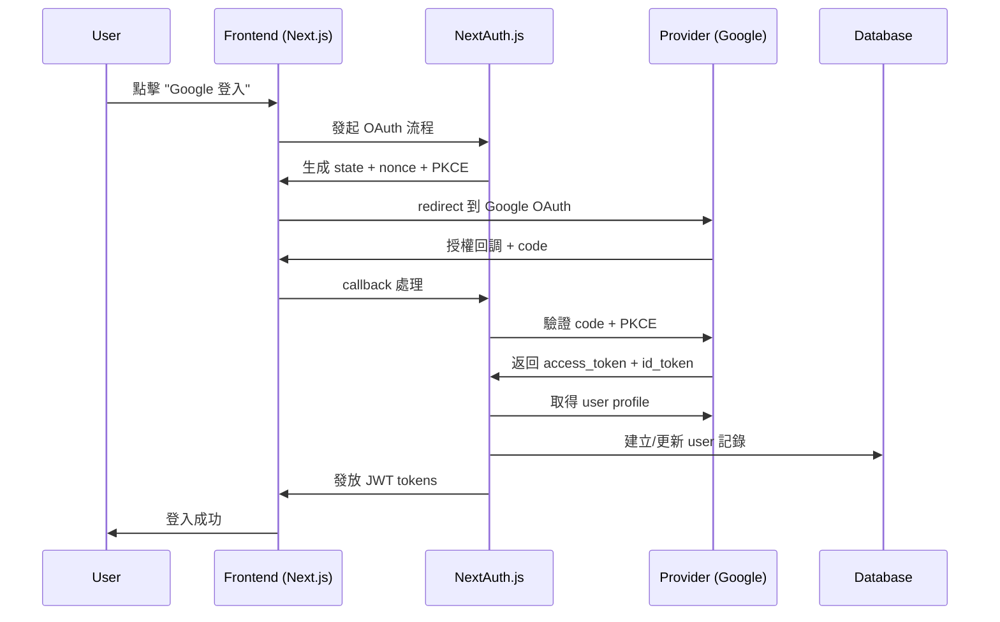

# 第三方登入需求（OAuth）

## 核心目標

實現第三方登入整合，以 Google 為 POC 起點，成功後再擴充 Facebook、Line 支援。

## Provider 支援計劃

### Phase 1: Google OAuth (POC)

- **優先級：** 最高，必須先完成
- **目標：** 功能正確率 ≥ 98%（回調/驗證流程）
- **範圍：** 完整 Authorization Code Flow with PKCE

### Phase 2: Facebook 整合

- **前提：** Google POC 成功後啟動
- **模式：** 以 Google 為模板實作

### Phase 3: Line 整合

- **特殊考量：** Line 可能不提供 email 或 email 未驗證
- **策略：** pending_social_registration 機制處理

## OAuth 流程設計

### Authorization Code Flow with PKCE



### Callback 處理細節

1. **安全驗證**
   - 驗證 state 參數防止 CSRF
   - 驗證 nonce 防止重放攻擊
   - 驗證 PKCE code_verifier

2. **Profile 處理**
   - 取得 provider profile（含 email, email_verified）
   - 驗證 id_token 簽章（OIDC）
   - 驗證 access token 有效性

3. **帳號合併邏輯**
   ```javascript
   if (provider.email && provider.email_verified) {
     // 自動嘗試合併現有帳號
     const existingUser = await findUserByEmail(provider.email);
     if (existingUser) {
       // 在 user_auth_providers 新增 provider 紀錄
       await linkProvider(existingUser.id, providerData);
     } else {
       // 建立新 user（email_verified = true）
       await createUser({
         email: provider.email,
         email_verified: true,
         display_name: provider.name,
       });
     }
   } else {
     // 建立 pending_social_registration
     await createPendingRegistration(providerData);
     // 轉向前台要求補填 email
   }
   ```

## Provider 特殊處理

### Google 特性

- **Email 驗證：** 通常都已驗證
- **Scope 要求：** `openid email profile`
- **特殊欄位：** 可取得 picture, locale 等額外資訊

### Facebook 特性

- **Email 驗證：** 通常已驗證但需確認
- **Scope 要求：** `email public_profile`
- **特殊考量：** 可能需處理 app review 流程

### Line 特殊情況

- **Email 可能未提供：** 需要特殊處理流程
- **處理策略：**

  ```javascript
  if (!provider.email || !provider.email_verified) {
    // 建立暫存記錄
    const tempToken = generateTempToken();
    await createPendingRegistration({
      provider: 'line',
      provider_profile: provider,
      temp_token: tempToken,
      expires_at: Date.now() + 24 * 60 * 60 * 1000, // 24小時
    });

    // 轉向前台要求補填 email
    return redirect(`/auth/complete-registration?token=${tempToken}`);
  }
  ```

## 安全考量

### CSRF 防護

- **State 參數：** 每次 OAuth 流程生成隨機 state
- **驗證機制：** callback 時驗證 state 匹配

### Token 安全

- **ID Token 驗證：** 驗證簽章、issuer、audience
- **Access Token：** 驗證有效期與範圍
- **Nonce 防護：** 防止 token 重放攻擊

### PKCE 支援

- **Code Verifier：** 生成 43-128 字元隨機字串
- **Code Challenge：** SHA256 hash 的 code verifier
- **Challenge Method：** S256

## 錯誤處理

### OAuth 錯誤類型

1. **使用者取消：** 轉向到登入頁面並顯示友善訊息
2. **Provider 錯誤：** 記錄錯誤並顯示通用錯誤訊息
3. **系統錯誤：** 記錄詳細錯誤並轉向錯誤頁面

### 日誌記錄

```javascript
// OAuth 流程日誌
const auditLog = {
  event_type: 'oauth_callback',
  provider: 'google',
  success: true,
  user_id: user?.id || null,
  ip: request.ip,
  user_agent: request.headers['user-agent'],
  created_at: new Date(),
};
```

## API 端點設計

### NextAuth.js 路徑

- `GET /api/auth/signin/google` - 發起 Google OAuth
- `GET /api/auth/callback/google` - Google OAuth callback
- `GET /api/auth/signin/facebook` - 發起 Facebook OAuth
- `GET /api/auth/callback/facebook` - Facebook OAuth callback
- `GET /api/auth/signin/line` - 發起 Line OAuth
- `GET /api/auth/callback/line` - Line OAuth callback

### 自定 API

- `POST /api/auth/complete-social-registration` - 完成 pending registration
- `GET /api/auth/providers` - 取得可用 provider 列表

## 測試要求

### Google OAuth 測試案例

1. **成功流程：** 完整 OAuth 登入並建立 user
2. **帳號合併：** 相同 email 自動合併
3. **錯誤處理：** 各種錯誤情況的正確處理
4. **安全測試：** CSRF、nonce、PKCE 驗證

### 效能測試

- **登入延遲：** < 300ms 平均回應時間
- **併發支援：** 支援多使用者同時登入

---

**相關文件：**

- [帳號管理需求](./account-management.md)
- [安全合規規格](./security-compliance.md)
- [測試案例規格](./test-cases.md)
- [資料模型規格](./data-models.md)
