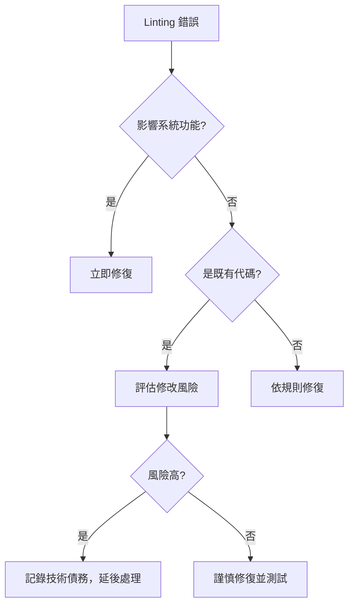

# ESLint 配置建議 - Brownfield 企業專案最佳實踐

## 🚨 **BROWNFIELD 開發約束** 🚨

**⚠️ 此配置建議必須遵循全專案 Brownfield 約束：**  
**[../BROWNFIELD-DEVELOPMENT-CONSTRAINTS.md](../BROWNFIELD-DEVELOPMENT-CONSTRAINTS.md)**

**重要提醒：**
- ❌ **絕不直接修改現有的 `.eslintrc.json`**
- ✅ 此文件僅提供未來新專案或重大版本升級時的參考
- ✅ 可用於新功能開發時的局部規則調整

---

## 📋 **當前配置分析**

### 現有配置（保持不變）
```json
{
  "extends": ["next/core-web-vitals", "next/typescript", "prettier"],
  "rules": {
    "@typescript-eslint/no-explicit-any": "warn",
    "@typescript-eslint/no-unused-vars": [
      "error",
      { "varsIgnorePattern": "^_", "argsIgnorePattern": "^_" }
    ],
    "@typescript-eslint/no-require-imports": "warn",
    "@next/next/no-img-element": "warn",
    "import/no-anonymous-default-export": "warn",
    "react-hooks/exhaustive-deps": "warn"
  }
}
```

### 配置評估結果 ✅
**優點：**
- 採用 Next.js 官方建議配置
- 合理的警告/錯誤級別分配
- 與 Prettier 整合良好

**Brownfield 相容性：** 非常適合，沒有過於嚴格的規則

---

## 🎯 **Brownfield 友善的增強配置建議**

### 建議的補充配置（僅供參考）

```json
{
  "extends": ["next/core-web-vitals", "next/typescript", "prettier"],
  "rules": {
    // 🟢 保持現有規則（不修改）
    "@typescript-eslint/no-explicit-any": "warn",
    "@typescript-eslint/no-unused-vars": [
      "error",
      { 
        "varsIgnorePattern": "^_", 
        "argsIgnorePattern": "^_",
        "ignoreRestSiblings": true
      }
    ],
    "@typescript-eslint/no-require-imports": "warn",
    "@next/next/no-img-element": "warn",
    "import/no-anonymous-default-export": "warn",
    "react-hooks/exhaustive-deps": "warn",
    
    // 🔵 建議新增的 Brownfield 友善規則
    "prefer-const": "warn", // 降級為警告
    "no-console": ["warn", { "allow": ["warn", "error"] }],
    "react-hooks/rules-of-hooks": "error", // 確保 Hook 規則
    "react/no-unescaped-entities": "warn", // HTML 實體警告
    
    // 🟡 可選的嚴格規則（新功能適用）
    "@typescript-eslint/explicit-function-return-type": "off", // 不強制返回型別
    "@typescript-eslint/no-unsafe-assignment": "off", // 允許不安全賦值
    "@typescript-eslint/no-unsafe-member-access": "off", // 允許不安全成員存取
    "@typescript-eslint/no-unsafe-call": "off", // 允許不安全呼叫
    "@typescript-eslint/no-unsafe-return": "off" // 允許不安全返回
  },
  
  // 🎯 檔案路徑特定規則覆蓋
  "overrides": [
    {
      // 📁 腳本檔案：最寬鬆規則
      "files": ["scripts/**/*.js", "scripts/**/*.ts", "*.config.js"],
      "rules": {
        "@typescript-eslint/no-require-imports": "off",
        "@typescript-eslint/no-explicit-any": "off",
        "@typescript-eslint/no-var-requires": "off",
        "no-console": "off"
      }
    },
    {
      // 🔌 API 路由：適中規則
      "files": ["src/app/api/**/*.ts"],
      "rules": {
        "@typescript-eslint/no-explicit-any": "off", // API 允許 any
        "no-console": ["warn", { "allow": ["warn", "error", "info"] }]
      }
    },
    {
      // 📱 頁面組件：標準規則
      "files": ["src/app/**/page.tsx", "src/app/**/layout.tsx"],
      "rules": {
        "@next/next/no-img-element": "error", // 頁面組件嚴格要求 Image
        "react-hooks/exhaustive-deps": "warn"
      }
    },
    {
      // 🧩 組件庫：嚴格規則
      "files": ["src/components/**/*.tsx"],
      "rules": {
        "react-hooks/exhaustive-deps": "warn",
        "@typescript-eslint/no-explicit-any": "warn"
      }
    },
    {
      // 🔧 工具函數：中等嚴格
      "files": ["src/lib/**/*.ts", "src/utils/**/*.ts"],
      "rules": {
        "@typescript-eslint/no-explicit-any": "warn",
        "@typescript-eslint/explicit-module-boundary-types": "off"
      }
    },
    {
      // 📝 型別定義：最嚴格
      "files": ["src/types/**/*.ts", "**/*.d.ts"],
      "rules": {
        "@typescript-eslint/no-explicit-any": "error",
        "@typescript-eslint/no-unused-vars": "error"
      }
    }
  ],
  
  // 🚫 全域忽略設定
  "ignorePatterns": [
    "node_modules/",
    ".next/",
    "dist/",
    "build/",
    "*.config.js",
    "flattened-codebase.xml"
  ]
}
```

---

## 🏗️ **段階式實施建議**

### Phase 1：評估階段（當前）✅
**狀態：** 已完成
- ✅ 分析現有配置適用性
- ✅ 確認 Brownfield 相容性
- ✅ 制定增強建議

**結論：** 現有配置已經相當適合 Brownfield 專案，**建議保持不變**

### Phase 2：局部試驗（可選）⚠️
**實施範圍：** 僅針對新功能開發
```json
// 可在新功能目錄中建立 .eslintrc.js
{
  "extends": ["../../.eslintrc.json"], // 繼承主配置
  "overrides": [
    {
      "files": ["**/*.ts", "**/*.tsx"],
      "rules": {
        // 針對新功能的嚴格規則
        "@typescript-eslint/no-explicit-any": "error"
      }
    }
  ]
}
```

### Phase 3：全面升級（未來版本）🔮
**觸發條件：**
- Next.js 主要版本升級（如 Next.js 15+）
- TypeScript 主要版本升級
- ESLint 生態系統重大變更

---

## 🛠️ **開發工具整合建議**

### VS Code 設定建議
```json
// .vscode/settings.json
{
  "eslint.enable": true,
  "eslint.autoFixOnSave": true,
  "eslint.validate": [
    "javascript",
    "javascriptreact",
    "typescript",
    "typescriptreact"
  ],
  
  // 🎯 Brownfield 友善設定
  "eslint.codeAction.showDocumentation": {
    "enable": true
  },
  "eslint.quiet": false, // 顯示所有警告
  "eslint.workingDirectories": ["next"] // 指定工作目錄
}
```

### Package.json 腳本增強
```json
{
  "scripts": {
    // 現有腳本（保持）
    "lint": "next lint",
    
    // 建議新增的腳本
    "lint:strict": "eslint . --ext .ts,.tsx --max-warnings 0",
    "lint:fix": "eslint . --ext .ts,.tsx --fix",
    "lint:check": "eslint . --ext .ts,.tsx --quiet",
    
    // Brownfield 特定腳本
    "lint:new-files": "git diff --name-only --diff-filter=A | grep -E '\\.(ts|tsx)$' | xargs eslint",
    "lint:modified": "git diff --name-only --diff-filter=M | grep -E '\\.(ts|tsx)$' | xargs eslint",
    
    // CI/CD 用腳本
    "lint:ci": "eslint . --ext .ts,.tsx --format json --output-file eslint-report.json"
  }
}
```

---

## 📊 **規則優先級與決策矩陣**

### 高優先級規則（必須遵守）
```typescript
// 🔴 絕對不可忽略的錯誤
"react-hooks/rules-of-hooks": "error", // Hook 使用規則
"react-hooks/exhaustive-deps": "error", // 依賴陣列完整性
"@typescript-eslint/no-unused-vars": "error", // 未使用變數
"no-undef": "error", // 未定義變數
```

### 中優先級規則（建議修復）
```typescript
// 🟡 應該修復的警告
"@next/next/no-img-element": "warn", // Next.js 圖片最佳化
"prefer-const": "warn", // const vs let
"no-console": "warn", // 避免生產環境 console
```

### 低優先級規則（可接受）
```typescript
// 🟢 可以接受的問題
"@typescript-eslint/no-explicit-any": "warn", // any 型別使用
"@typescript-eslint/no-require-imports": "warn", // CommonJS 導入
```

### 決策流程圖


---

## 🧪 **測試與驗證策略**

### 自動化測試整合
```javascript
// jest.config.js 中整合 ESLint
{
  "scripts": {
    "test:lint": "jest --testNamePattern='ESLint'",
    "test:lint-new": "jest --testPathPattern='__tests__/lint'"
  }
}

// __tests__/lint/eslint.test.js
describe('ESLint Rules', () => {
  test('New files should have no linting errors', async () => {
    const { ESLint } = require('eslint');
    const eslint = new ESLint();
    
    const results = await eslint.lintFiles(['src/**/*.{ts,tsx}']);
    const errorCount = results.reduce((sum, result) => 
      sum + result.errorCount, 0);
    
    expect(errorCount).toBe(0);
  });
});
```

### CI/CD 整合
```yaml
# .github/workflows/lint.yml
name: ESLint Check
on: [push, pull_request]
jobs:
  lint:
    runs-on: ubuntu-latest
    steps:
      - uses: actions/checkout@v3
      - uses: actions/setup-node@v3
        with:
          node-version: '18'
      - run: npm ci
      - run: npm run lint:ci
      - name: Upload ESLint report
        uses: actions/upload-artifact@v3
        with:
          name: eslint-report
          path: eslint-report.json
```

---

## 📈 **效能與最佳化**

### ESLint 效能最佳化設定
```json
{
  "parser": "@typescript-eslint/parser",
  "parserOptions": {
    "ecmaVersion": 2022,
    "sourceType": "module",
    "ecmaFeatures": {
      "jsx": true
    },
    // 🚀 效能最佳化
    "project": "./tsconfig.json",
    "tsconfigRootDir": ".",
    "createDefaultProgram": false // 避免不必要的 TypeScript 編譯
  },
  
  "settings": {
    // 📦 模組解析最佳化
    "import/resolver": {
      "typescript": {
        "alwaysTryTypes": true,
        "project": "./tsconfig.json"
      },
      "node": {
        "extensions": [".js", ".jsx", ".ts", ".tsx"]
      }
    }
  }
}
```

### 快取策略
```json
// package.json
{
  "scripts": {
    "lint:cache": "eslint --cache --cache-location .eslintcache .",
    "lint:cache-clear": "rm -rf .eslintcache"
  }
}
```

---

## 🔍 **監控與報告**

### 自動化報告生成
```javascript
// scripts/lint-report.js
const { ESLint } = require('eslint');
const fs = require('fs');

async function generateLintReport() {
  const eslint = new ESLint();
  const results = await eslint.lintFiles(['src/**/*.{ts,tsx}']);
  
  const report = {
    timestamp: new Date().toISOString(),
    totalFiles: results.length,
    totalErrors: results.reduce((sum, result) => sum + result.errorCount, 0),
    totalWarnings: results.reduce((sum, result) => sum + result.warningCount, 0),
    ruleBreakdown: {}
  };
  
  // 統計規則違反次數
  results.forEach(result => {
    result.messages.forEach(message => {
      if (!report.ruleBreakdown[message.ruleId]) {
        report.ruleBreakdown[message.ruleId] = 0;
      }
      report.ruleBreakdown[message.ruleId]++;
    });
  });
  
  fs.writeFileSync('lint-report.json', JSON.stringify(report, null, 2));
  console.log('Lint report generated:', report);
}

generateLintReport().catch(console.error);
```

### 趨勢追蹤
```bash
# 建議的定期執行腳本
#!/bin/bash
# weekly-lint-check.sh

echo "$(date): Running weekly lint check" >> lint-history.log
npm run lint 2>&1 | grep -E "error|warning" | wc -l >> lint-history.log
```

---

## 💡 **常見問題與解決方案**

### Q1: 如何處理第三方套件的型別問題？
```typescript
// ✅ 建議解決方案
/* eslint-disable @typescript-eslint/no-explicit-any */
// 原因：第三方套件 xyz 版本 1.0.0 型別定義不完整
import { SomeComponent } from 'problematic-package';
const config: any = { /* 第三方配置 */ };
/* eslint-enable @typescript-eslint/no-explicit-any */

// 🔄 長期解決方案
// 1. 尋找 @types/problematic-package
// 2. 建立自定義型別定義
// 3. 升級到有更好型別支援的版本
```

### Q2: 如何處理動態生成的程式碼？
```typescript
// ✅ 針對特定情況的配置
{
  "overrides": [
    {
      "files": ["src/generated/**/*.ts"],
      "rules": {
        "@typescript-eslint/no-explicit-any": "off",
        "@typescript-eslint/no-unused-vars": "off"
      }
    }
  ]
}
```

### Q3: 如何在不同環境使用不同規則？
```typescript
// ✅ 環境特定配置
{
  "env": {
    "development": {
      "rules": {
        "no-console": "warn", // 開發環境允許 console
        "no-debugger": "warn"
      }
    },
    "production": {
      "rules": {
        "no-console": "error", // 生產環境禁止 console
        "no-debugger": "error"
      }
    }
  }
}
```

---

## 🚀 **未來路線圖**

### 短期目標（3個月）
- [ ] 完成現有問題的分級處理
- [ ] 建立自動化報告機制
- [ ] 整合 CI/CD 檢查流程

### 中期目標（6個月）
- [ ] 評估 ESLint 9.0 升級可行性
- [ ] 建立組件庫專用的嚴格規則
- [ ] 完善型別定義覆蓋率

### 長期目標（1年）
- [ ] 考慮整合 Biome 或其他新工具
- [ ] 建立跨專案的 ESLint 配置共享
- [ ] 完成技術債務的系統性清理

---

**最後更新：2025-08-20**  
**版本：v1.0**  
**維護者：智能治理專家系統**  
**適用範圍：Corp-Insight Next.js 14 專案**