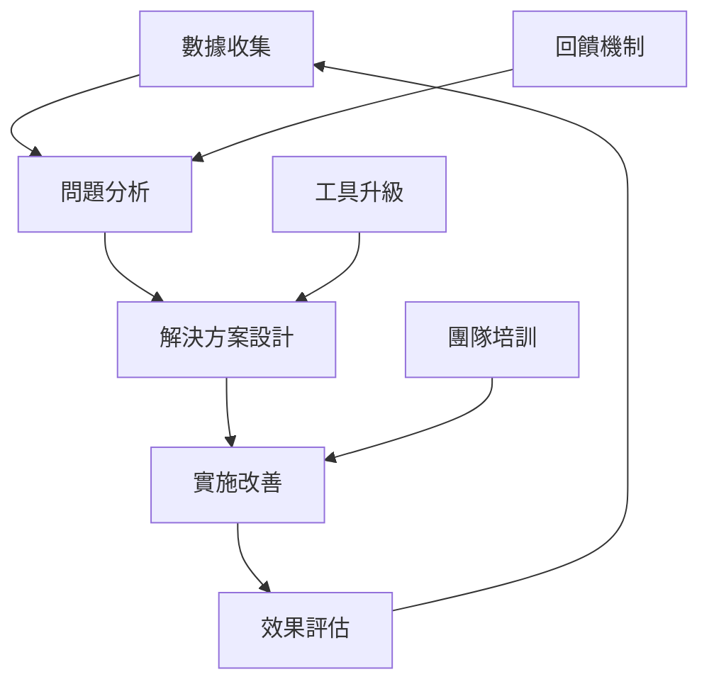

# 未來 Linting 問題防範機制 - 持續品質保證系統

## 🚨 **BROWNFIELD 開發約束** 🚨

**⚠️ 此防範機制必須遵循全專案 Brownfield 約束：**  
**[../BROWNFIELD-DEVELOPMENT-CONSTRAINTS.md](../BROWNFIELD-DEVELOPMENT-CONSTRAINTS.md)**

**防範原則：**
- ❌ 絕不強制修改既有程式碼以符合新規則
- ❌ 絕不中斷既有開發流程  
- ✅ 僅對新增程式碼實施嚴格標準
- ✅ 建立漸進式品質改善機制

---

## 🎯 **防範策略總覽**

### 三層防護體系

#### 🛡️ **第一層：開發期防範（Pre-Development）**
- IDE 配置與擴充套件
- 專案範本與腳手架
- 開發者培訓與指引

#### 🔍 **第二層：開發中防範（During Development）**  
- 即時 linting 回饋
- Git hooks 檢查
- 程式碼審查自動化

#### 🚀 **第三層：集成期防範（Post-Development）**
- CI/CD 管道檢查
- 品質監控儀表板
- 自動化報告與警報

---

## 🛠️ **第一層：開發期防範機制**

### VS Code 整合配置

#### 推薦的 VS Code 設定
```json
// .vscode/settings.json（專案層級）
{
  "eslint.enable": true,
  "eslint.format.enable": true,
  "eslint.lintTask.enable": true,
  
  // 🎯 Brownfield 友善設定
  "eslint.codeAction.showDocumentation": {
    "enable": true
  },
  "eslint.codeActionOnSave.rules": [
    "@typescript-eslint/no-unused-vars",
    "prefer-const",
    "import/no-duplicates"
  ],
  
  // 僅對新檔案啟用嚴格檢查
  "eslint.workingDirectories": [
    {
      "mode": "auto",
      "changeProcessCWD": true
    }
  ],
  
  // TypeScript 設定
  "typescript.preferences.useAliasesForRenames": false,
  "typescript.preferences.includePackageJsonAutoImports": "auto",
  "typescript.suggest.autoImports": true,
  "typescript.suggest.includeAutomaticOptionalChainCompletions": true,
  
  // 格式化設定
  "editor.formatOnSave": true,
  "editor.codeActionsOnSave": {
    "source.fixAll.eslint": true,
    "source.organizeImports": true
  },
  
  // 針對不同檔案類型的特殊設定
  "[typescript]": {
    "editor.defaultFormatter": "esbenp.prettier-vscode"
  },
  "[typescriptreact]": {
    "editor.defaultFormatter": "esbenp.prettier-vscode"
  }
}
```

#### 推薦的 VS Code 擴充套件
```json
// .vscode/extensions.json
{
  "recommendations": [
    "esbenp.prettier-vscode",
    "dbaeumer.vscode-eslint",
    "ms-vscode.vscode-typescript-next",
    "bradlc.vscode-tailwindcss",
    "ms-vscode.vscode-json"
  ],
  "unwantedRecommendations": [
    "ms-vscode.vscode-typescript"
  ]
}
```

### 新功能開發範本

#### 組件範本（Brownfield 相容）
```typescript
// templates/component.template.tsx
'use client';

import { FC } from 'react';

// 🎯 嚴格類型定義（新功能標準）
interface ${ComponentName}Props {
  // 明確定義所有 props，避免 any
}

// 🎯 具名導出，避免 default export 問題
export const ${ComponentName}: FC<${ComponentName}Props> = ({
  // 解構所有 props，避免未使用參數警告
}) => {
  // 🎯 使用 useCallback 和 useMemo 避免 Hook 依賴問題
  const handleAction = useCallback(() => {
    // 事件處理邏輯
  }, []); // 明確依賴陣列

  return (
    <div>
      {/* 🎯 使用 Next.js Image 而非 img */}
      {/* 使用語意化 HTML */}
      {/* 避免 unescaped entities */}
    </div>
  );
};

// 🎯 型別導出供其他模組使用
export type { ${ComponentName}Props };
```

#### API 路由範本（Brownfield 相容）
```typescript
// templates/api-route.template.ts
import { NextRequest, NextResponse } from 'next/server';

// 🎯 明確的請求/回應型別（新功能標準）
interface ${FeatureName}Request {
  // 避免 any，定義具體型別
}

interface ${FeatureName}Response {
  success: boolean;
  data?: unknown; // 如需靈活性可用 unknown 而非 any
  error?: string;
}

export async function GET(request: NextRequest): Promise<NextResponse<${FeatureName}Response>> {
  try {
    // 🎯 使用既有的資料庫連線模式（Brownfield 約束）
    await connectToDatabase();
    
    // 業務邏輯
    const result = await processRequest();
    
    return NextResponse.json({
      success: true,
      data: result,
    });
  } catch (error) {
    // 🎯 統一的錯誤處理格式（遵循既有模式）
    console.error('${FeatureName} API error:', error);
    return NextResponse.json(
      {
        success: false,
        error: '處理失敗',
        details: error instanceof Error ? error.message : 'Unknown error',
      },
      { status: 500 }
    );
  }
}
```

### 開發者指引文件

#### 新功能開發檢查清單
```markdown
## 新功能開發前檢查 ✅

### 環境準備
- [ ] VS Code 已安裝推薦擴充套件
- [ ] ESLint 和 Prettier 運作正常
- [ ] 熟悉 Brownfield 開發約束

### 程式碼品質標準
- [ ] 不使用 `any` 型別（除非有明確原因並註釋）
- [ ] 所有 React Hook 依賴陣列完整
- [ ] 使用 Next.js Image 而非 html img 標籤
- [ ] 使用 ES6+ import 而非 CommonJS require
- [ ] 所有函數和變數都有明確用途（無未使用變數）

### Brownfield 相容性
- [ ] 沒有修改既有程式碼
- [ ] 沒有變更既有 API 介面
- [ ] 沒有影響既有功能
- [ ] 遵循既有的架構模式
```

---

## 🔍 **第二層：開發中防範機制**

### Git Hooks 整合

#### Pre-commit Hook 實作
```javascript
// .husky/pre-commit
#!/usr/bin/env sh
. "$(dirname -- "$0")/_/husky.sh"

echo "🔍 執行 pre-commit 檢查..."

# 🎯 僅檢查暫存的檔案（Brownfield 友善）
npx lint-staged

# 🎯 檢查是否意外修改了既有檔案的核心邏輯
echo "🛡️ 檢查 Brownfield 約束合規性..."
node scripts/check-brownfield-compliance.js

echo "✅ Pre-commit 檢查完成"
```

#### Lint-staged 配置
```json
// package.json
{
  "lint-staged": {
    // 🎯 只對新增和修改的檔案執行嚴格檢查
    "*.{ts,tsx}": [
      "eslint --fix --max-warnings 0", // 新檔案不允許警告
      "prettier --write"
    ],
    "*.{js,jsx}": [
      "eslint --fix",
      "prettier --write"
    ],
    "*.{json,md,yml,yaml}": [
      "prettier --write"
    ]
  }
}
```

#### Brownfield 合規性檢查腳本
```javascript
// scripts/check-brownfield-compliance.js
const { execSync } = require('child_process');
const fs = require('fs');
const path = require('path');

// 🛡️ 核心檔案列表（禁止修改）
const PROTECTED_FILES = [
  'src/app/api/*/route.ts',
  'src/lib/database/connection.ts',
  'src/lib/gemini.server.ts',
  '.eslintrc.json'
];

// 🔍 檢查暫存檔案是否涉及受保護檔案
function checkProtectedFiles() {
  try {
    const stagedFiles = execSync('git diff --cached --name-only', { encoding: 'utf8' })
      .split('\n')
      .filter(Boolean);
    
    const protectedModified = stagedFiles.filter(file => 
      PROTECTED_FILES.some(pattern => 
        file.match(new RegExp(pattern.replace('*', '.*')))
      )
    );
    
    if (protectedModified.length > 0) {
      console.error('🚨 檢測到修改受保護檔案:');
      protectedModified.forEach(file => console.error(`  - ${file}`));
      console.error('📋 請參閱 BROWNFIELD-DEVELOPMENT-CONSTRAINTS.md');
      process.exit(1);
    }
    
    console.log('✅ Brownfield 約束檢查通過');
  } catch (error) {
    console.error('❌ 檢查失敗:', error.message);
    process.exit(1);
  }
}

checkProtectedFiles();
```

### 即時程式碼品質監控

#### VS Code 任務配置
```json
// .vscode/tasks.json
{
  "version": "2.0.0",
  "tasks": [
    {
      "label": "Lint New Files",
      "type": "shell",
      "command": "npm",
      "args": ["run", "lint:new"],
      "group": "build",
      "presentation": {
        "echo": true,
        "reveal": "always",
        "focus": false,
        "panel": "shared",
        "showReuseMessage": true,
        "clear": false
      },
      "problemMatcher": ["$eslint-stylish"]
    },
    {
      "label": "Brownfield Compliance Check",
      "type": "shell",
      "command": "node",
      "args": ["scripts/check-brownfield-compliance.js"],
      "group": "test"
    }
  ]
}
```

#### 自動化程式碼審查

##### Pull Request 範本
```markdown
<!-- .github/pull_request_template.md -->
## 變更摘要
<!-- 請簡述此 PR 的主要變更 -->

## Brownfield 合規檢查 🚨
- [ ] ❌ 沒有修改任何既有程式碼
- [ ] ❌ 沒有變更既有 API 介面  
- [ ] ❌ 沒有影響既有功能
- [ ] ✅ 僅新增新功能相關程式碼
- [ ] ✅ 遵循既有架構模式

## 程式碼品質檢查 🔍
- [ ] ESLint 檢查通過（0 errors, 0 warnings for new code）
- [ ] TypeScript 編譯通過
- [ ] 所有測試通過
- [ ] 程式碼審查通過

## 測試確認 🧪
- [ ] 新功能測試正常
- [ ] 既有功能未受影響
- [ ] 效能沒有明顯下降

## 相關文件
- [ ] 已更新相關文件（如適用）
- [ ] 已更新 API 文件（如適用）
```

---

## 🚀 **第三層：集成期防範機制**

### CI/CD 管道整合

#### GitHub Actions 工作流程
```yaml
# .github/workflows/code-quality.yml
name: Code Quality Gate

on:
  push:
    branches: [ main, develop ]
  pull_request:
    branches: [ main ]

jobs:
  lint-and-typecheck:
    runs-on: ubuntu-latest
    
    steps:
    - uses: actions/checkout@v4
      with:
        fetch-depth: 0 # 需要完整歷史記錄以比較變更
        
    - name: Setup Node.js
      uses: actions/setup-node@v4
      with:
        node-version: '18'
        cache: 'npm'
        
    - name: Install dependencies
      run: npm ci
      
    - name: Brownfield Compliance Check
      run: node scripts/check-brownfield-compliance.js
      
    - name: Lint New/Modified Files Only
      run: |
        # 🎯 只檢查變更的檔案
        git diff --name-only origin/main..HEAD | grep -E '\.(ts|tsx)$' | xargs npm run lint --
      
    - name: TypeScript Type Check
      run: npx tsc --noEmit
      
    - name: Build Test
      run: npm run build
      
    - name: Generate Quality Report
      run: node scripts/generate-quality-report.js
      if: always()
      
    - name: Upload Quality Report
      uses: actions/upload-artifact@v4
      with:
        name: quality-report
        path: quality-report.json
      if: always()

  quality-gate:
    needs: lint-and-typecheck
    runs-on: ubuntu-latest
    if: always()
    
    steps:
    - name: Quality Gate Check
      run: |
        # 設定品質門檻
        if [ "${{ needs.lint-and-typecheck.result }}" != "success" ]; then
          echo "🚨 品質檢查未通過，無法合併"
          exit 1
        else
          echo "✅ 品質檢查通過，可以合併"
        fi
```

#### 品質報告生成器
```javascript
// scripts/generate-quality-report.js
const { execSync } = require('child_process');
const fs = require('fs');

async function generateQualityReport() {
  const report = {
    timestamp: new Date().toISOString(),
    commit: process.env.GITHUB_SHA || 'unknown',
    branch: process.env.GITHUB_REF_NAME || 'unknown',
    
    // 🎯 Linting 統計
    linting: await getLintingStats(),
    
    // 🎯 TypeScript 統計
    typescript: await getTypeScriptStats(),
    
    // 🎯 建置統計
    build: await getBuildStats(),
    
    // 🎯 Brownfield 合規性
    brownfieldCompliance: await checkBrownfieldCompliance(),
    
    // 🎯 檔案變更統計
    changes: await getChangeStats()
  };
  
  fs.writeFileSync('quality-report.json', JSON.stringify(report, null, 2));
  console.log('📊 品質報告已生成');
  
  // 輸出關鍵指標到 GitHub Actions
  console.log(`::set-output name=lint-errors::${report.linting.errors}`);
  console.log(`::set-output name=lint-warnings::${report.linting.warnings}`);
  console.log(`::set-output name=typescript-errors::${report.typescript.errors}`);
}

async function getLintingStats() {
  try {
    const output = execSync('npm run lint 2>&1', { encoding: 'utf8' });
    const errors = (output.match(/Error:/g) || []).length;
    const warnings = (output.match(/Warning:/g) || []).length;
    
    return { errors, warnings, details: output };
  } catch (error) {
    return { errors: -1, warnings: -1, error: error.message };
  }
}

async function getTypeScriptStats() {
  try {
    const output = execSync('npx tsc --noEmit 2>&1', { encoding: 'utf8' });
    const errors = (output.match(/error TS\d+/g) || []).length;
    
    return { errors, details: output };
  } catch (error) {
    const errors = (error.stdout.match(/error TS\d+/g) || []).length;
    return { errors, details: error.stdout };
  }
}

generateQualityReport().catch(console.error);
```

### 品質監控儀表板

#### 簡易監控指標
```javascript
// scripts/quality-dashboard.js
const fs = require('fs');
const path = require('path');

class QualityDashboard {
  constructor() {
    this.metricsFile = 'quality-metrics.json';
    this.loadMetrics();
  }
  
  loadMetrics() {
    try {
      this.metrics = JSON.parse(fs.readFileSync(this.metricsFile, 'utf8'));
    } catch {
      this.metrics = { history: [] };
    }
  }
  
  addMetric(metric) {
    this.metrics.history.push({
      ...metric,
      timestamp: new Date().toISOString()
    });
    
    // 保留最近 30 天的記錄
    const thirtyDaysAgo = new Date(Date.now() - 30 * 24 * 60 * 60 * 1000);
    this.metrics.history = this.metrics.history.filter(
      m => new Date(m.timestamp) > thirtyDaysAgo
    );
    
    fs.writeFileSync(this.metricsFile, JSON.stringify(this.metrics, null, 2));
  }
  
  generateReport() {
    const latest = this.metrics.history[this.metrics.history.length - 1];
    const weekAgo = this.metrics.history.find(m => 
      new Date(m.timestamp) > new Date(Date.now() - 7 * 24 * 60 * 60 * 1000)
    );
    
    console.log('📊 程式碼品質儀表板');
    console.log('='.repeat(50));
    console.log(`🔍 Linting 狀況:`);
    console.log(`   當前錯誤數: ${latest?.linting?.errors || 0}`);
    console.log(`   當前警告數: ${latest?.linting?.warnings || 0}`);
    console.log(`   週變化: ${this.calculateTrend(latest, weekAgo, 'linting.errors')}`);
    
    console.log(`🎯 TypeScript 狀況:`);
    console.log(`   當前錯誤數: ${latest?.typescript?.errors || 0}`);
    console.log(`   週變化: ${this.calculateTrend(latest, weekAgo, 'typescript.errors')}`);
    
    console.log(`🚀 建置狀況: ${latest?.build?.status || 'Unknown'}`);
    console.log(`🛡️ Brownfield 合規: ${latest?.brownfieldCompliance || 'Unknown'}`);
  }
  
  calculateTrend(current, previous, path) {
    if (!current || !previous) return '無資料';
    
    const currentValue = this.getNestedValue(current, path) || 0;
    const previousValue = this.getNestedValue(previous, path) || 0;
    const change = currentValue - previousValue;
    
    if (change > 0) return `📈 +${change}`;
    if (change < 0) return `📉 ${change}`;
    return '➡️ 無變化';
  }
  
  getNestedValue(obj, path) {
    return path.split('.').reduce((o, p) => o && o[p], obj);
  }
}

// 使用範例
const dashboard = new QualityDashboard();
dashboard.generateReport();
```

---

## 📋 **持續改善機制**

### 定期檢視流程

#### 週檢視（開發團隊）
```bash
#!/bin/bash
# scripts/weekly-quality-check.sh

echo "📊 本週程式碼品質檢視"
echo "執行時間: $(date)"
echo "================================="

# 統計新增程式碼的品質
echo "🆕 新增程式碼品質:"
git diff --name-only HEAD~7..HEAD | grep -E '\.(ts|tsx)$' | xargs npm run lint -- 2>&1 | grep -E "error|warning" | wc -l

# 整體專案品質趨勢
echo "📈 整體品質趨勢:"
npm run lint 2>&1 | grep -E "error|warning" | wc -l

# Brownfield 合規性檢查
echo "🛡️ Brownfield 合規性:"
node scripts/check-brownfield-compliance.js && echo "✅ 合規" || echo "❌ 發現問題"

echo "================================="
echo "詳細報告請查看 quality-report.json"
```

#### 月檢視（技術負責人）
```markdown
## 月度程式碼品質檢視報告

### 關鍵指標趨勢
- **Lint 錯誤數**：當前 vs 上月
- **新功能品質**：新增程式碼的 lint 通過率
- **開發效率影響**：因品質問題導致的開發延遲

### Brownfield 約束遵循情況
- **既有程式碼修改次數**：應該為 0
- **意外影響事件**：記錄任何因修改既有程式碼導致的問題

### 改善建議
- 識別重複出現的問題類型
- 更新開發指引和範本
- 調整工具配置
```

### 規則調整機制

#### 規則有效性評估
```javascript
// scripts/rule-effectiveness-analysis.js
const fs = require('fs');

class RuleEffectivenessAnalyzer {
  analyze() {
    const lintHistory = this.loadLintHistory();
    const ruleStats = this.calculateRuleStats(lintHistory);
    
    // 分析最常違反的規則
    const topViolations = Object.entries(ruleStats)
      .sort(([,a], [,b]) => b.count - a.count)
      .slice(0, 10);
    
    // 評估規則價值
    const lowValueRules = topViolations.filter(([rule, stats]) => 
      stats.count > 50 && stats.fixedRatio < 0.3
    );
    
    console.log('📊 規則有效性分析');
    console.log('最常違反但修復率低的規則（考慮調整）:');
    lowValueRules.forEach(([rule, stats]) => {
      console.log(`- ${rule}: 違反 ${stats.count} 次，修復率 ${Math.round(stats.fixedRatio * 100)}%`);
    });
  }
}
```

### 知識庫建設

#### 常見問題文件庫
```markdown
## Linting 問題解決知識庫

### 🔴 高頻問題

#### Q1: any 類型的合理使用場景
**問題描述**: 何時可以使用 any 類型？
**解決方案**: 
- ✅ 第三方 API 回應格式不確定
- ✅ 動態生成的物件結構
- ✅ 逐步遷移過程中的暫時性使用
- ❌ 懶惰的型別定義

#### Q2: useEffect 依賴陣列最佳實踐
**問題描述**: 如何正確設定 useEffect 依賴？
**解決方案**:
```typescript
// ❌ 錯誤方式
useEffect(() => {
  fetchData(userId); // userId 未在依賴中
}, []); 

// ✅ 正確方式
useEffect(() => {
  fetchData(userId);
}, [userId]); // 包含所有使用的狀態
```

### 🟡 中頻問題

#### Q3: Image vs img 的權衡
**問題描述**: 何時必須使用 Next.js Image？
**解決方案**:
- ✅ 內容圖片：必須使用 Image
- ✅ 首屏圖片：Image with priority
- ⚠️ 圖標：可考慮 SVG 或小尺寸 img
- ⚠️ 第三方圖片：需要配置 domains
```

---

## 🎓 **團隊培訓與知識傳承**

### 新人入職培訓

#### Linting 基礎培訓課程
```markdown
## 課程大綱：Brownfield 專案的 Linting 最佳實踐

### 第 1 節：理解 Brownfield 約束 (30 分鐘)
- Brownfield vs Greenfield 開發模式
- 為什麼要保護既有程式碼
- 實際案例分享

### 第 2 節：ESLint 配置理解 (45 分鐘)
- 當前專案 ESLint 配置解析
- 各規則的用途和重要性
- 如何使用 eslint-disable 註釋

### 第 3 節：實戰練習 (60 分鐘)
- 建立符合標準的新功能
- 處理常見 linting 問題
- 使用開發工具提升效率

### 第 4 節：品質流程 (30 分鐘)
- Git hooks 和 CI/CD 整合
- Code review 注意事項
- 品質監控使用方法
```

### 進階培訓主題

#### TypeScript 最佳實踐工作坊
- 漸進式型別改善策略
- 複雜型別定義技巧
- 效能考量與權衡

#### React Hook 最佳化專題
- useCallback 和 useMemo 使用時機
- 自定義 Hook 的 linting 考量
- 效能監控與最佳化

---

## 📈 **成效追蹤與持續最佳化**

### 關鍵成功指標（KSI）

#### 量化指標
1. **新程式碼品質率**：新功能的 lint 通過率 > 95%
2. **既有程式碼保護率**：意外修改既有程式碼事件 = 0
3. **開發效率**：因 linting 問題導致的開發延遲 < 5%
4. **問題解決速度**：linting 問題平均解決時間 < 30 分鐘

#### 品質指標
1. **技術債務控制**：整體 lint 錯誤數量不增長
2. **最佳實踐採用率**：新程式碼中最佳實踐模式使用率
3. **知識分享效果**：團隊成員 linting 問題諮詢頻率下降

### 持續最佳化循環



#### 最佳化觸發機制
- **自動觸發**：當錯誤數量超過閾值時
- **定期觸發**：每季度進行全面檢視
- **事件觸發**：當發生 Brownfield 約束違反時
- **主動觸發**：團隊成員提出改善建議時

---

## 🔮 **未來展望與技術路線圖**

### 短期計畫（3個月）
- [ ] 完成所有防範機制的實施
- [ ] 建立完整的監控儀表板
- [ ] 完成團隊培訓課程

### 中期計畫（6個月）
- [ ] 評估新工具和技術的可行性
- [ ] 建立跨專案的最佳實踐分享機制
- [ ] 完善自動化品質保證流程

### 長期展望（1年以上）
- [ ] 考慮整合 AI 輔助程式碼審查
- [ ] 建立業界最佳實踐的企業級 linting 標準
- [ ] 促成開源社群的最佳實踐貢獻

---

**最後更新：2025-08-20**  
**版本：v1.0**  
**維護者：智能治理專家系統**  
**適用範圍：Corp-Insight Next.js 14 專案**

**注意：此防範機制設計完全符合 Brownfield 開發約束，確保在提升新程式碼品質的同時，完全不影響既有系統的穩定性和功能。**